## The OSI Model: An Overview

The **OSI (Open Systems Interconnection)** Model is a standardised model which we use to demonstrate the theory behind computer networking. In practice, it's actually the more compact TCP/IP model that real-world networking is based off; however the OSI model, in many ways, is easier to get an initial understanding from.

The OSI model consists of seven layers: Application, Presentation, Session, Transport, Network, Data Link, Physical

### Layer 7 -- Application:

The application layer of the OSI model essentially provides networking options to programs running on a computer. It works almost exclusively with applications, providing an interface for them to use in order to transmit data. When data is given to the application layer, it is passed down into the presentation layer.

### Layer 6 -- Presentation:

The presentation layer receives data from the application layer. This data tends to be in a format that the application understands, but it's not necessarily in a standardised format that could be understood by the application layer in the receiving computer. The presentation layer translates the data into a standardised format, as well as handling any encryption, compression or other transformations to the data. With this complete, the data is passed down to the session layer.

### Layer 5 -- Session:

When the session layer receives the correctly formatted data from the presentation layer, it looks to see if it can set up a connection with the other computer across the network. If it can't then it sends back an error and the process goes no further. If a session can be established then it's the job of the session layer to maintain it, as well as co-operate with the session layer of the remote computer in order to synchronise communications. The session layer is particularly important as the session that it creates is unique to the communication in question. This is what allows you to make multiple requests to different endpoints simultaneously without all the data getting mixed up (think about opening two tabs in a web browser at the same time)! When the session layer has successfully logged a connection between the host and remote computer the data is passed down to Layer 4: the transport Layer.

### Layer 4 -- Transport:

The transport layer is a very interesting layer that serves numerous important functions. Its first purpose is to choose the protocol over which the data is to be transmitted. The two most common protocols in the transport layer are **TCP (Transmission Control Protocol) and UDP (User Datagram Protocol)**; with TCP the transmission is connection-based which means that a connection between the computers is established and maintained for the duration of the request. This allows for a reliable transmission, as the connection can be used to ensure that the packets all get to the right place. A TCP connection allows the two computers to remain in constant communication to ensure that the data is sent at an acceptable speed, and that any lost data is re-sent. With UDP, the opposite is true; packets of data are essentially thrown at the receiving computer -- if it can't keep up then that's its problem (this is why a video transmission over something like Skype can be pixelated if the connection is bad). What this means is that TCP would usually be chosen for situations where accuracy is favoured over speed (e.g. file transfer, or loading a webpage), and UDP would be used in situations where speed is more important (e.g. video streaming).

With a protocol selected, the transport layer then divides the transmission up into bite-sized pieces (over TCP these are called segments, over UDP they're called datagrams), which makes it easier to transmit the message successfully. 

### Layer 3 -- Network:

The network layer is responsible for locating the destination of your request. For example, the Internet is a huge network; when you want to request information from a webpage, it's the network layer that takes the IP address for the page and figures out the best route to take. At this stage we're working with what is referred to as Logical addressing (i.e. IP addresses) which are still software controlled. Logical addresses are used to provide order to networks, categorising them and allowing us to properly sort them. Currently the most common form of logical addressing is the IPV4 format, which you'll likely already be familiar with (i.e 192.168.1.1 is a common address for a home router).

### Layer 2 -- Data Link:

The data link layer focuses on the physical addressing of the transmission. It receives a packet from the network layer (that includes the IP address for the remote computer) and adds in the physical (MAC) address of the receiving endpoint. Inside every network enabled computer is a Network Interface Card (NIC) which comes with a unique MAC (Media Access Control) address to identify it.

MAC addresses are set by the manufacturer and literally burnt into the card; they can't be changed -- although they can be spoofed. When information is sent across a network, it's actually the physical address that is used to identify where exactly to send the information.

Additionally, it's also the job of the data link layer to present the data in a format suitable for transmission.

The data link layer also serves an important function when it receives data, as it checks the received information to make sure that it hasn't been corrupted during transmission, which could well happen when the data is transmitted by layer 1: the physical layer.

### Layer 1 -- Physical:

The physical layer is right down to the hardware of the computer. This is where the electrical pulses that make up data transfer over a network are sent and received. It's the job of the physical layer to convert the binary data of the transmission into signals and transmit them across the network, as well as receiving incoming signals and converting them back into binary data.

| id | Layer         | Function                                                                                  |
|----|---------------|-------------------------------------------------------------------------------------------|
| 7  | Application   | Interfaces with applications to enable data transmission between programs.                |
| 6  | Presentation  | Standardizes data formats, handles encryption, compression, and transformations.          |
| 5  | Session       | Establishes, manages, and terminates communication sessions between devices.              |
| 4  | Transport     | Handles data transport protocols (e.g., TCP for reliable connections, UDP for faster, less reliable transfers) and breaks data into manageable chunks. |
| 3  | Network       | Determines the best path to the destination using logical addressing (IP addresses).      |
| 2  | Data Link     | Adds physical addressing (MAC addresses) and ensures error-free data transmission.         |
| 1  | Physical      | Transmits raw binary data as electrical signals over hardware.                            |

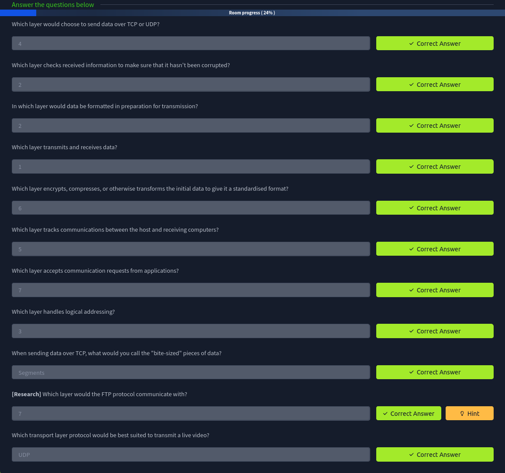

## Encapsulation
As the data is passed down each layer of the model, more information containing details specific to the layer in question is added on to the start of the transmission. As an example, the header added by the **Network Layer** would include things like **the source and destination IP addresses**, and the header added by the **Transport Layer** would include (amongst other things) **information specific to the protocol** being used. The data link layer also adds a piece on at the end of the transmission, which is used to verify that the data has not been corrupted on transmission; this also has the added bonus of increased security, as the data can't be intercepted and tampered with without breaking the trailer. This whole process is referred to as **encapsulation**; the process by which data can be sent from one computer to another.

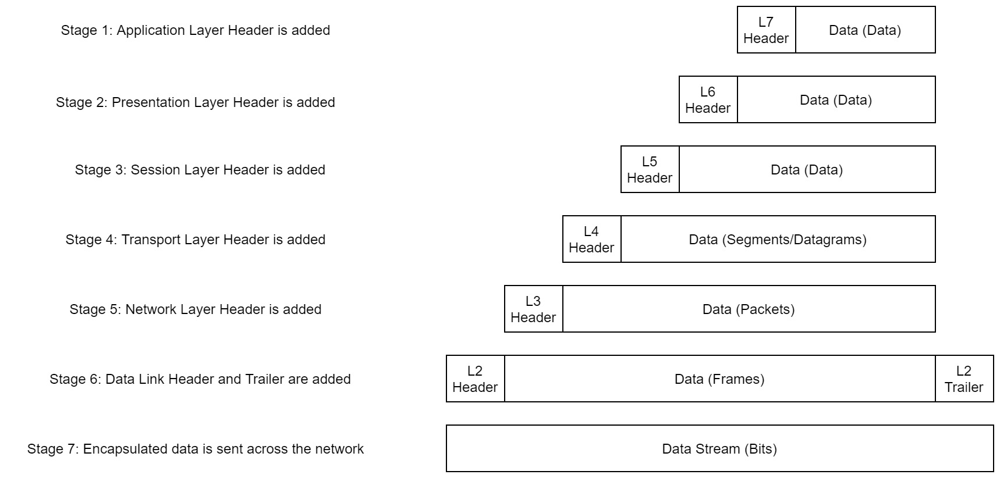

Notice that the encapsulated data is given a different name at different steps of the process. In layers 7,6 and 5, the data is simply referred to as **data**. In the transport layer the encapsulated data is referred to as a **segment** or a **datagram** (depending on whether TCP or UDP has been selected as a transmission protocol). At the Network Layer, the data is referred to as a **packet**. When the packet gets passed down to the Data Link layer it becomes a **frame**, and by the time it's transmitted across a network the frame has been broken down into **bits**.

When the message is received by the second computer, it reverses the process -- starting at the physical layer and working up until it reaches the application layer, stripping off the added information as it goes. This is referred to as **de-encapsulation**. As such you can think of the layers of the OSI model as existing inside every computer with network capabilities. Whilst it's not actually as clear cut in practice, computers all follow the same process of encapsulation to send data and de-encapsulation upon receiving it.

The processes of encapsulation and de-encapsulation are very important -- not least because of their practical use, but also because they give us a standardised method for sending data. This means that all transmissions will consistently follow the same methodology, allowing any network enabled device to send a request to any other reachable device and be sure that it will be understood -- regardless of whether they are from the same manufacturer; use the same operating system; or any other factors.

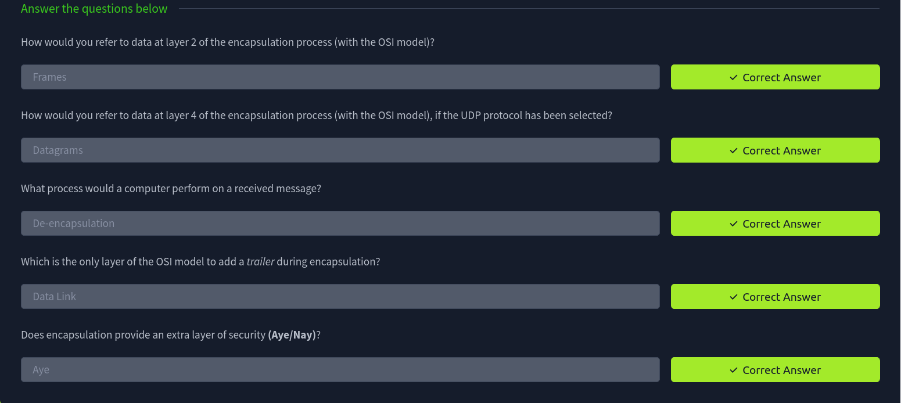

## The TCP/IP Model

The TCP/IP model is, in many ways, very similar to the OSI model. It's a few years older, and serves as the basis for real-world networking. The TCP/IP model consists of four layers: **Application, Transport, Internet and Network Interface**. Between them, these cover the same range of functions as the seven layers of the OSI Model.

Comparison between the TCP/IP and OSI models.
<table>
  <tr>
    <th>OSI</th>
    <th>TCP/IP</th>
  </tr>
  <tr>
    <td>Application</td>
    <td rowspan="3">Application</td>
  </tr>
  <tr>
    <td>Presentation</td>
  </tr>
  <tr>
    <td>Session</td>
  </tr>
  <tr>
    <td>Transport</td>
    <td>Transport</td>
  </tr>
  <tr>
    <td>Network</td>
    <td>Internet</td>
  </tr>
  <tr>
    <td>Data Link</td>
    <td rowspan="2">Network Interface</td>
  </tr>
  <tr>
    <td>Physical</td>
  </tr>
</table>

The processes of **encapsulation** and **de-encapsulation** work in exactly the same way with the TCP/IP model as they do with the OSI model. At each layer of the TCP/IP model a header is added during encapsulation, and removed during de-encapsulation.

When we talk about TCP/IP, it's all well and good to think about a table with four layers in it, but we're actually talking about a suite of protocols -- sets of rules that define how an action is to be carried out. TCP/IP takes its name from the two most important of these: the **Transmission Control Protocol** (which we touched upon earlier in the OSI model) that controls the flow of data between two endpoints, and the **Internet Protocol**, which controls how packets are addressed and sent. There are many more protocols that make up the TCP/IP suite. For now though, let's talk about TCP.
### TCP
As mentioned earlier, TCP is a connection-based protocol. In other words, before you send any data via TCP, you must first form a stable connection between the two computers. The process of forming this connection is called the **three-way handshake**.

When you attempt to make a connection, your computer first sends a special request to the remote server indicating that it wants to initialise a connection. This request contains something called a **SYN** (short for synchronise) bit, which essentially makes first contact in starting the connection process. The server will then respond with a packet containing the SYN bit, as well as another "acknowledgement" bit, called **ACK**. Finally, your computer will send a packet that contains the ACK bit by itself, confirming that the connection has been setup successfully. With the three-way handshake successfully completed, data can be reliably transmitted between the two computers. Any data that is lost or corrupted on transmission is re-sent, thus leading to a connection which appears to be lossless.

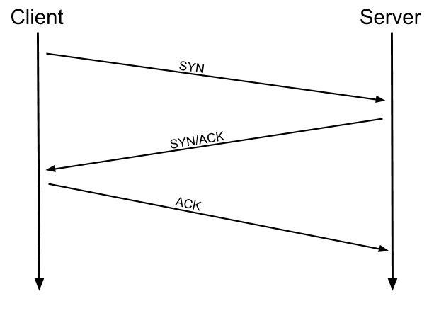

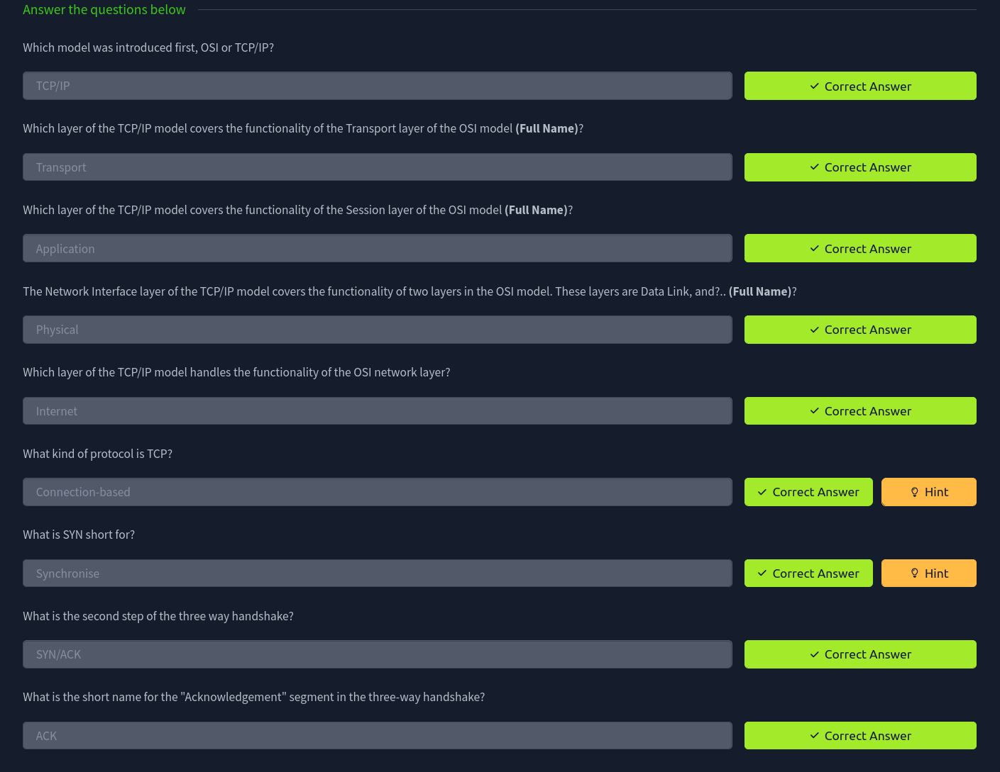
## Ping
 The `ping` command is used when we want to test whether a connection to a remote resource is possible. Usually this will be a website on the internet, but it could also be for a computer on your home network if you want to check if it's configured correctly. Ping works using the ICMP protocol, which is one of the slightly less well-known TCP/IP protocols that were mentioned earlier. The ICMP protocol works on the Network layer of the OSI Model, and thus the Internet layer of the TCP/IP model. The basic syntax for ping is ping <target>. In this example we are using ping to test whether a network connection to Google is possible:

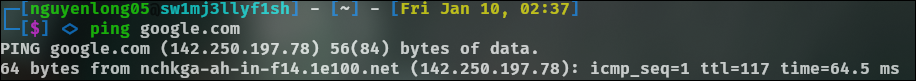

Notice that the ping command actually returned the IP address for the Google server that it connected to, rather than the URL that was requested. This is a handy secondary application for ping, as it can be used to determine the IP address of the server hosting a website. One of the big advantages of ping is that it's pretty much ubiquitous to any network enabled device. All operating systems support it out of the box, and even most embedded devices can use ping!

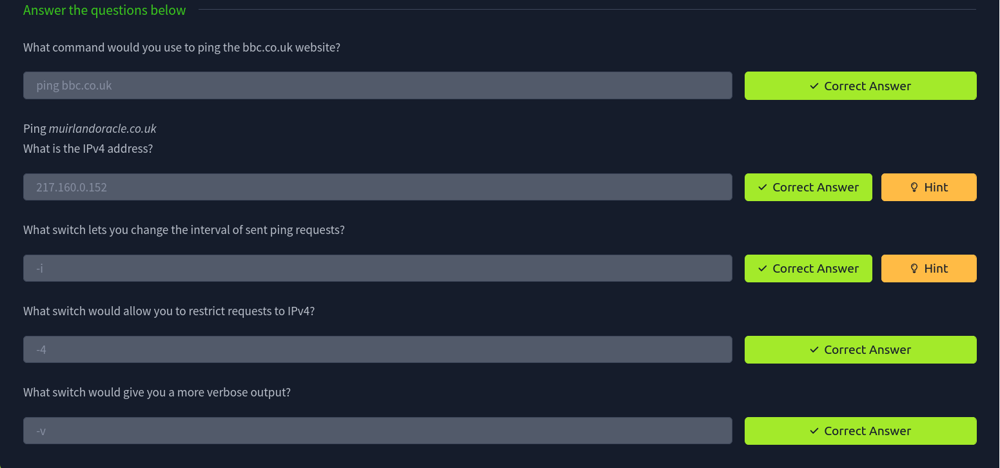

## Traceroute
 The logical follow-up to the ping command is 'traceroute'. Traceroute can be used to map the path your request takes as it heads to the target machine.

The internet is made up of many, many different servers and end-points, all networked up to each other. This means that, in order to get to the content you actually want, you first need to go through a bunch of other servers. Traceroute allows you to see each of these connections -- it allows you to see every intermediate step between your computer and the resource that you requested. The basic syntax for traceroute on Linux is this: `traceroute <destination>`

By default, the Windows traceroute utility (`tracert`) operates using the same ICMP protocol that ping utilises, and the Unix equivalent operates over UDP. This can be altered with switches in both instances.

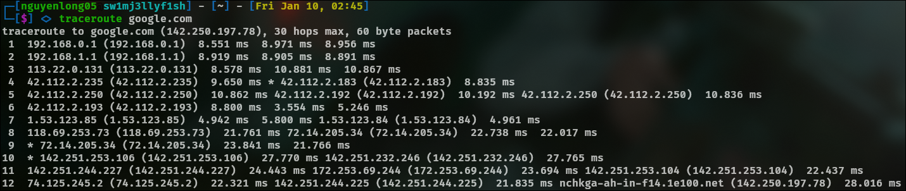

You can see that it took 12 hops to get from my router to the Google server

## Whois
Whois essentially allows you to query who a domain name is registered to. In Europe personal details are redacted; however, elsewhere you can potentially get a great deal of information from a whois search.

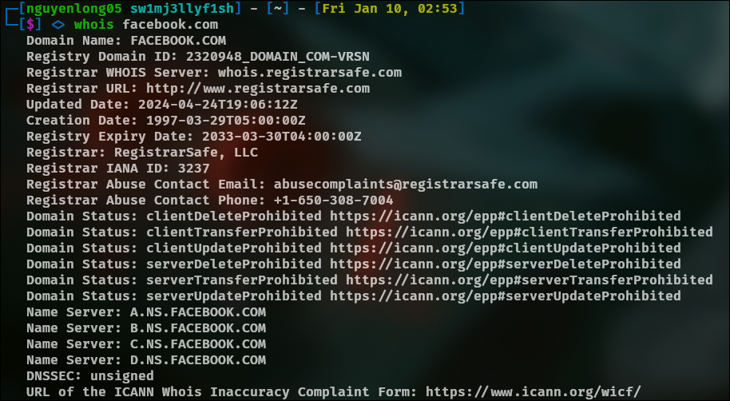

This is comparatively a very small amount of information as can often be found. Notice that we've got the domain name, the company that registered the domain, the last renewal, and when it's next due, and a bunch of information about nameservers (which we'll look at in the next task).

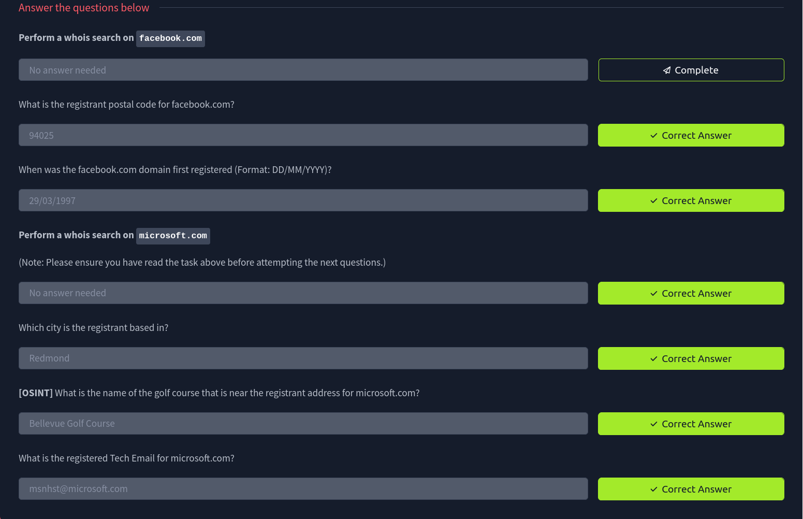

## Dig
Ever wondered how a URL gets converted into an IP address that your computer can understand? The answer is a TCP/IP protocol called DNS (Domain Name System).

At the most basic level, DNS allows us to ask a special server to give us the IP address of the website we're trying to access. For example, if we made a request to www.google.com, our computer would first send a request to a special DNS server (which your computer already knows how to find). The server would then go looking for the IP address for Google and send it back to us. Our computer could then send the request to the IP of the Google server.

Let's break this down a bit.

You make a request to a website. The first thing that your computer does is check its local "Hosts File" to see if an explicit IP->Domain mapping has been created. This is an older system than DNS and much less commonly used in modern environments; however, it still takes precedence in the search order of most operating systems. If no mapping has been manually created, the computer then checks its local DNS cache to see if it already has an IP address stored for the website; if it does, great. If not, it goes to the next stage of the process.

Assuming the address hasn't already been found, your computer will then send a request to what is known as a recursive DNS server. These will automatically be known to the router on your network. Many Internet Service Providers (ISPs) maintain their own recursive servers, but companies such as Google and OpenDNS also control recursive servers. This is how your computer automatically knows where to send the request for information: details for a recursive DNS server are stored in your router or computer. This server will also maintain a cache of results for popular domains; however, if the website you've requested isn't stored in the cache, the recursive server will pass the request on to a root name server.

Before 2004 there were precisely 13 root name DNS servers in the world. These days there are many more; however, they are still accessible using the same 13 IP addresses assigned to the original servers (balanced so that you get the closest server when you make a request). The root name servers essentially keep track of the DNS servers in the next level down, choosing an appropriate one to redirect your request to. These lower level servers are called Top-Level Domain servers.

Top-Level Domain (TLD) servers are split up into extensions. So, for example, if you were searching for tryhackme.com your request would be redirected to a TLD server that handled .com domains. If you were searching for bbc.co.uk your request would be redirected to a TLD server that handles .co.uk domains. As with root name servers, TLD servers keep track of the next level down: Authoritative name servers. When a TLD server receives your request for information, the server passes it down to an appropriate Authoritative name server.

Authoritative name servers are used to store DNS records for domains directly. In other words, every domain in the world will have its DNS records stored on an Authoritative name server somewhere or another; they are the source of the information. When your request reaches the authoritative name server for the domain you're querying, it will send the relevant information back to you, allowing your computer to connect to the IP address behind the domain you requested.

| Step                     | Description                                                                                                                                                                                                    |
|--------------------------|----------------------------------------------------------------------------------------------------------------------------------------------------------------------------------------------------------------|
| 1. Hosts File            | Computer first checks its local Hosts File for explicit IP-to-domain mappings.                                                                                                                                |
| 2. Local DNS Cache       | If not found in the Hosts File, it checks the local DNS cache for a previously stored IP address.                                                                                                             |
| 3. Recursive DNS Server  | If not cached, a request is sent to a recursive DNS server (provided by ISP, Google, or OpenDNS). This server may also have a cached result. If no cache is found, it forwards the request to a root DNS server. |
| 4. Root DNS Server       | The root DNS server redirects the request to the appropriate Top-Level Domain (TLD) server based on the domain extension (e.g., .com, .co.uk).                                                                 |
| 5. TLD Server            | The TLD server identifies and redirects the request to the authoritative name server for the queried domain.                                                                                                  |
| 6. Authoritative Server  | The authoritative DNS server stores the DNS records of the queried domain and returns the IP address (or other requested DNS record) to the recursive DNS server.                                             |
| 7. Response and Caching  | The recursive DNS server caches the response (for future requests) and relays it back to the original client.                                                                                                 |

When you visit a website in your web browser this all happens automatically, but we can also do it manually with a tool called `dig` . Like ping and traceroute, dig should be installed automatically on Linux systems.

Dig allows us to manually query recursive DNS servers of our choice for information about domains:
`dig <domain> @<dns-server-ip>`

Performing a DIG DNS lookup on google.com

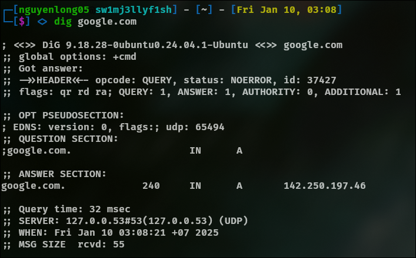

We're currently most interested in the `ANSWER`. In summary, that information is telling us that we sent it one query and successfully (i.e. No Errors) received one full answer -- which, as expected, contains the IP address for the domain name that we queried.

Another interesting piece of information that dig gives us is the TTL (Time To Live) of the queried DNS record. As mentioned previously, when your computer queries a domain name, it stores the results in its local cache. The TTL of the record tells your computer when to stop considering the record as being valid -- i.e. when it should request the data again, rather than relying on the cached copy.

The TTL can be found in the second column of the answer section: **240**

It's important to remember that TTL (in the context of DNS caching) is measured in seconds, so the record in the example will expire in 240 seconds.

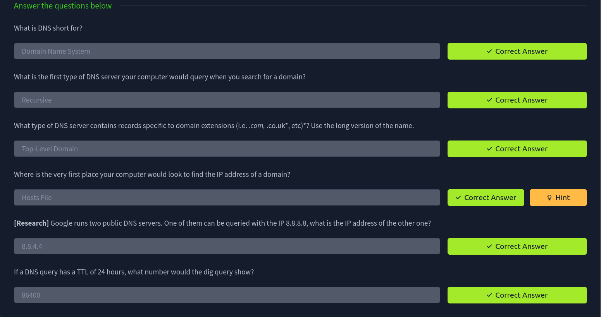