## Introduction
Say we have been given an IP (or multiple IP addresses) to perform a security audit on. Before we do anything else, we need to get an idea of the “landscape” we are attacking. What this means is that we need to establish which services are running on the targets. For example, perhaps one of them is running a webserver, and another is acting as a Windows Active Directory Domain Controller. The first stage in establishing this “map” of the landscape is something called port scanning. When a computer runs a network service, it opens a networking construct called a “port” to receive the connection.  Ports are necessary for making multiple network requests or having multiple services available. For example, when you load several webpages at once in a web browser, the program must have some way of determining which tab is loading which web page. This is done by establishing connections to the remote webservers using different ports on your local machine. Equally, if you want a server to be able to run more than one service (for example, perhaps you want your webserver to run both HTTP and HTTPS versions of the site), then you need some way to direct the traffic to the appropriate service. Once again, ports are the solution to this. Network connections are made between two ports – an open port listening on the server and a randomly selected port on your own computer. For example, when you connect to a web page, your computer may open port 49534 to connect to the server’s port 443.

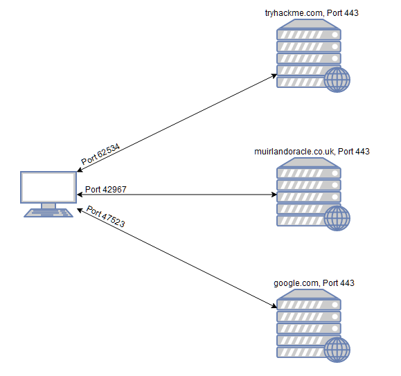

As in the previous example, the diagram shows what happens when you connect to numerous websites at the same time. Your computer opens up a different, high-numbered port (at random), which it uses for all its communications with the remote server.

Every computer has a total of 65535 available ports; however, many of these are registered as standard ports. For example, a HTTP Webservice can nearly always be found on port 80 of the server. A HTTPS Webservice can be found on port 443. Windows NETBIOS can be found on port 139 and SMB can be found on port 445. It is important to note; however, that especially in a CTF setting, it is not unheard of for even these standard ports to be altered, making it even more imperative that we perform appropriate enumeration on the target.

If we do not know which of these ports a server has open, then we do not have a hope of successfully attacking the target; thus, it is crucial that we begin any attack with a port scan. This can be accomplished in a variety of ways – usually using a tool called nmap, which is the focus of this room. Nmap can be used to perform many different kinds of port scan – the most common of these will be introduced in upcoming tasks; however, the basic theory is this: nmap will connect to each port of the target in turn. Depending on how the port responds, it can be determined as being open, closed, or filtered (usually by a firewall). Once we know which ports are open, we can then look at enumerating which services are running on each port – either manually, or more commonly using nmap.

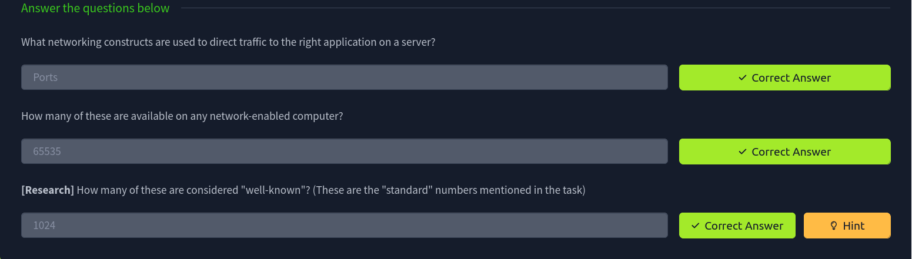

### Nmap switches

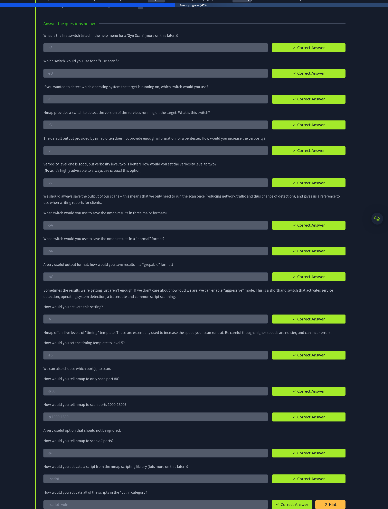

### Overview
When port scanning with Nmap, there are three basic scan types. These are:

-    TCP Connect Scans (-sT)
-    SYN "Half-open" Scans (-sS)
-    UDP Scans (-sU)

Additionally there are several less common port scan types, some of which we will also cover (albeit in less detail). These are:

-    TCP Null Scans (-sN)
-    TCP FIN Scans (-sF)
-    TCP Xmas Scans (-sX)

Most of these (with the exception of UDP scans) are used for very similar purposes, however, the way that they work differs between each scan. This means that, whilst one of the first three scans are likely to be your go-to in most situations, it's worth bearing in mind that other scan types exist.

In terms of network scanning, we will also look briefly at ICMP (or "ping") scanning.
## Scan Types
### TCP Connect Scans
First the connecting terminal (our attacking machine, in this instance) sends a TCP request to the target server with the SYN flag set. The server then acknowledges this packet with a TCP response containing the SYN flag, as well as the ACK flag. Finally, our terminal completes the handshake by sending a TCP request with the ACK flag set.

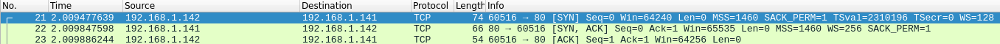

TCP Connect scan works by performing the three-way handshake with each target port in turn. In other words, Nmap tries to connect to each specified TCP port, and determines whether the service is open by the response it receives.

For example, if a port is closed, RFC 9293 states that:

"... If the connection does not exist (CLOSED), then a reset is sent in response to any incoming segment except another reset. A SYN segment that does not match an existing connection is rejected by this means."

In other words, if Nmap sends a TCP request with the SYN flag set to a closed port, the target server will respond with a TCP packet with the RST (Reset) flag set. By this response, Nmap can establish that the port is closed.

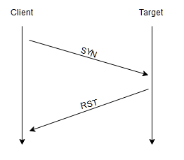

If, however, the request is sent to an open port, the target will respond with a TCP packet with the SYN/ACK flags set. Nmap then marks this port as being open (and completes the handshake by sending back a TCP packet with ACK set).

Many firewalls are configured to simply drop incoming packets. Nmap sends a TCP SYN request, and receives nothing back. This indicates that the port is being protected by a firewall and thus the port is considered to be filtered.

That said, it is very easy to configure a firewall to respond with a RST TCP packet. For example, in IPtables for Linux, a simple version of the command would be as follows:

`iptables -I INPUT -p tcp --dport <port> -j REJECT --reject-with tcp-reset`

This can make it extremely difficult (if not impossible) to get an accurate reading of the target(s).

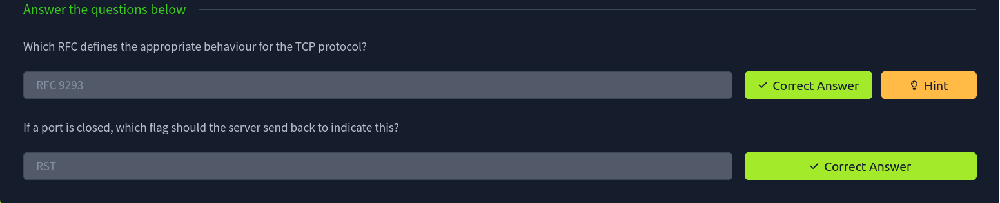

### SYN Scans
As with TCP scans, SYN scans (`-sS`) are used to scan the TCP port-range of a target or targets; however, the two scan types work slightly differently. SYN scans are sometimes referred to as "Half-open" scans, or "Stealth" scans.

Where TCP scans perform a full three-way handshake with the target, SYN scans sends back a RST TCP packet after receiving a SYN/ACK from the server (this prevents the server from repeatedly trying to make the request). In other words, the sequence for scanning an open port looks like this:

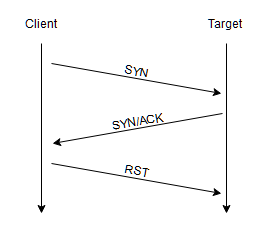

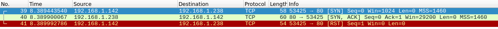

This has a variety of advantages for us as hackers:

-    It can be used to bypass older Intrusion Detection systems as they are looking out for a full three way handshake. This is often no longer the case with modern IDS solutions; it is for this reason that SYN scans are still frequently referred to as "stealth" scans.
-    SYN scans are often not logged by applications listening on open ports, as standard practice is to log a connection once it's been fully established. Again, this plays into the idea of SYN scans being stealthy.
-    Without having to bother about completing (and disconnecting from) a three-way handshake for every port, SYN scans are significantly faster than a standard TCP Connect scan.

There are, however, a couple of disadvantages to SYN scans, namely:

-    They require sudo permissions[1] in order to work correctly in Linux. This is because SYN scans require the ability to create raw packets (as opposed to the full TCP handshake), which is a privilege only the root user has by default.
-    Unstable services are sometimes brought down by SYN scans, which could prove problematic if a client has provided a production environment for the test.

All in all, the pros outweigh the cons.

For this reason, SYN scans are the default scans used by Nmap if run with sudo permissions. If run without sudo permissions, Nmap defaults to the TCP Connect scan we saw in the previous task.

When using a SYN scan to identify closed and filtered ports, the exact same rules as with a TCP Connect scan apply.

If a port is closed then the server responds with a RST TCP packet. If the port is filtered by a firewall then the TCP SYN packet is either dropped, or spoofed with a TCP reset.

In this regard, the two scans are identical: the big difference is in how they handle open ports.

[1] SYN scans can also be made to work by giving Nmap the CAP_NET_RAW, CAP_NET_ADMIN and CAP_NET_BIND_SERVICE capabilities; however, this may not allow many of the NSE scripts to run properly.

### UDP Scans
Unlike TCP, UDP connections are stateless. This means that, rather than initiating a connection with a back-and-forth "handshake", UDP connections rely on sending packets to a target port and essentially hoping that they make it. This makes UDP superb for connections which rely on speed over quality (e.g. video sharing), but the lack of acknowledgement makes UDP significantly more difficult (and much slower) to scan. The switch for an Nmap UDP scan is (`-sU`)

- When a packet is sent to an open UDP port, there should be no response. When this happens, Nmap refers to the port as being **open|filtered**. In other words, it suspects that the port is open, but it could be firewalled. If it gets a UDP response (which is very unusual), then the port is marked as open. More commonly there is no response, in which case the request is sent a second time as a double-check. If there is still no response then the port is marked **open|filtered** and Nmap moves on.

- When a packet is sent to a closed UDP port, the target should respond with an ICMP (ping) packet containing a message that the port is **unreachable**. This clearly identifies closed ports, which Nmap marks as such and moves on.

Due to this difficulty in identifying whether a UDP port is actually open, UDP scans tend to be incredibly slow in comparison to the various TCP scans (in the region of 20 minutes to scan the first 1000 ports, with a good connection). For this reason it's usually good practice to run an Nmap scan with `--top-ports <number>` enabled. For example, scanning with  `nmap -sU --top-ports 20 <target>`. Will scan the top 20 most commonly used UDP ports, resulting in a much more acceptable scan time.

### NULL, FIN and Xmas
As the name suggests, NULL scans (`-sN`) are when the TCP request is sent with no flags set at all. As per the RFC, the target host should respond with a RST if the port is closed.

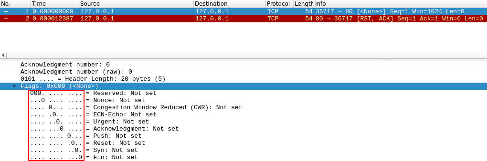

FIN scans (`-sF`) work in an almost identical fashion; however, instead of sending a completely empty packet, a request is sent with the FIN flag (usually used to gracefully close an active connection). Once again, Nmap expects a RST if the port is closed.

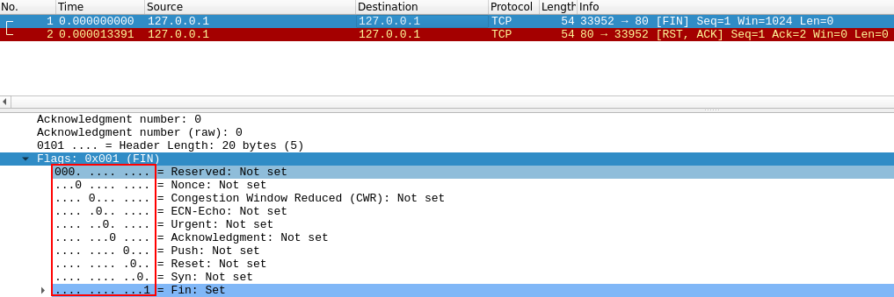

As with the other two scans in this class, Xmas scans (`-sX`) send a malformed TCP packet and expects a RST response for closed ports. It's referred to as an xmas scan as the flags that it sets (PSH, URG and FIN) give it the appearance of a blinking christmas tree when viewed as a packet capture in Wireshark. 

The expected response for open ports with these scans is also identical, and is very similar to that of a UDP scan. If the port is open then there is no response to the malformed packet. Unfortunately (as with open UDP ports), that is also an expected behaviour if the port is protected by a firewall, so NULL, FIN and Xmas scans will only ever identify ports as being open|filtered, closed, or filtered. If a port is identified as filtered with one of these scans then it is usually because the target has responded with an ICMP unreachable packet.

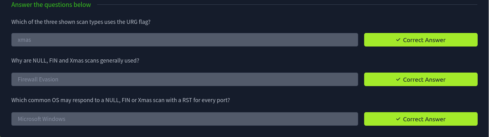

### ICMP Network Scanning

On first connection to a target network in a black box assignment, our first objective is to obtain a "map" of the network structure -- or, in other words, we want to see which IP addresses contain active hosts, and which do not.

One way to do this is by using Nmap to perform a so called "ping sweep". This is exactly as the name suggests: Nmap sends an ICMP packet to each possible IP address for the specified network. When it receives a response, it marks the IP address that responded as being alive. For reasons we'll see in a later task, this is not always accurate; however, it can provide something of a baseline and thus is worth covering.

To perform a ping sweep, we use the -sn switch in conjunction with IP ranges which can be specified with either a hypen (-) or CIDR notation. i.e. we could scan the 192.168.0.x network using:

`nmap -sn 192.168.0.1-254`

or

`nmap -sn 192.168.0.0/24`

The `-sn` switch tells Nmap not to scan any ports -- forcing it to rely primarily on ICMP echo packets (or ARP requests on a local network, if run with sudo or directly as the root user) to identify targets. In addition to the ICMP echo requests, the `-sn` switch will also cause nmap to send a TCP SYN packet to port 443 of the target, as well as a TCP ACK (or TCP SYN if not run as root) packet to port 80 of the target.

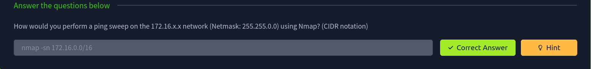
## NSE Scripts
The Nmap Scripting Engine (NSE) is an incredibly powerful addition to Nmap, extending its functionality quite considerably. NSE Scripts are written in the Lua programming language, and can be used to do a variety of things: from scanning for vulnerabilities, to automating exploits for them. The NSE is particularly useful for reconnaisance, however, it is well worth bearing in mind how extensive the script library is.

There are many categories available. Some useful categories include:

-    safe:- Won't affect the target
-    intrusive:- Not safe: likely to affect the target
-    vuln:- Scan for vulnerabilities
-    exploit:- Attempt to exploit a vulnerability
-    auth:- Attempt to bypass authentication for running services (e.g. Log into an FTP server anonymously)
-    brute:- Attempt to bruteforce credentials for running services
-    discovery:- Attempt to query running services for further information about the network (e.g. query an SNMP server).

A more exhaustive list can be found [here](https://nmap.org/book/nse-usage.html).

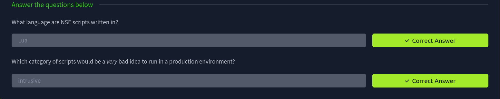

To run a specific script, we would use `--script=<script-name>` 

Multiple scripts can be run simultaneously in this fashion by separating them by a comma. For example: `--script=smb-enum-users,smb-enum-shares.`

Some scripts require arguments (for example, credentials, if they're exploiting an authenticated vulnerability). These can be given with the `--script-args` Nmap switch. An example of this would be with the http-put script (used to upload files using the PUT method). This takes two arguments: the URL to upload the file to, and the file's location on disk.  For example:
`nmap -p 80 --script http-put --script-args http-put.url='/dav/shell.php',http-put.file='./shell.php'`

Note that the arguments are separated by commas, and connected to the corresponding script with periods (i.e.  `<script-name>.<argument>`).

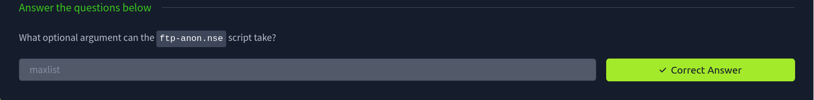

### Searching for script
We have two options for this, which should ideally be used in conjunction with each other. The first is the page on the [Nmap website](https://nmap.org/nsedoc/) which contains a list of all official scripts. The second is the local storage on your attacking machine. Nmap stores its scripts on Linux at `/usr/share/nmap/scripts`. All of the NSE scripts are stored in this directory by default -- this is where Nmap looks for scripts when you specify them.

There are two ways to search for installed scripts. One is by using the `/usr/share/nmap/scripts/script.db` file. Despite the extension, this isn't actually a database so much as a formatted text file containing filenames and categories for each available script.

Nmap uses this file to keep track of (and utilise) scripts for the scripting engine; however, we can also grep through it to look for scripts. For example: `grep "ftp" /usr/share/nmap/scripts/script.db`.

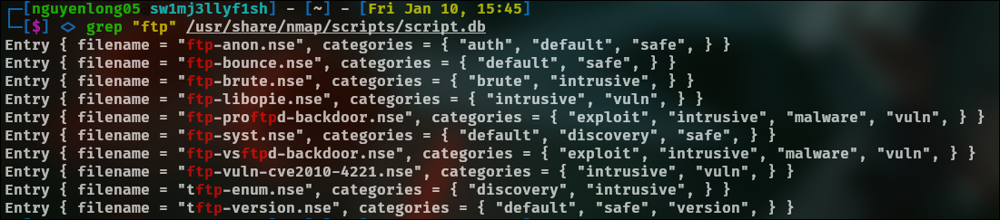

The second way to search for scripts is quite simply to use the `ls` command. For example, we could get the same results as in the previous screenshot by using `ls -l /usr/share/nmap/scripts/*ftp*`

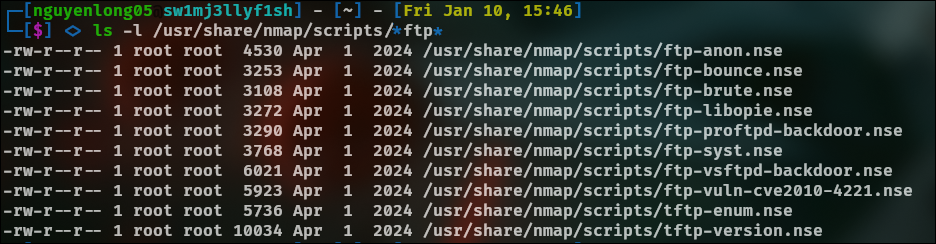

The same techniques can also be used to search for categories of script. For example:
`grep "safe" /usr/share/nmap/scripts/script.db`

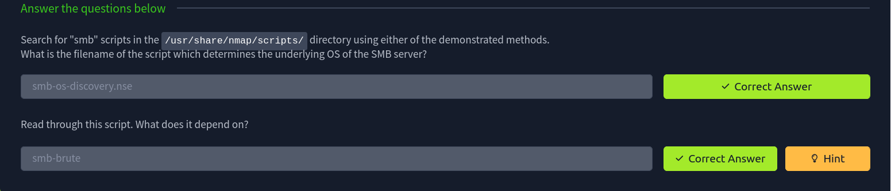

## Firewall Evasion
We have already seen some techniques for bypassing firewalls (think stealth scans, along with NULL, FIN and Xmas scans); however, there is another very common firewall configuration which it's imperative we know how to bypass.

Your typical Windows host will, with its default firewall, block all ICMP packets. This presents a problem: not only do we often use ping to manually establish the activity of a target, Nmap does the same thing by default. This means that Nmap will register a host with this firewall configuration as dead and not bother scanning it at all.

So, we need a way to get around this configuration. Fortunately Nmap provides an option for this: `-Pn`, which tells Nmap to not bother pinging the host before scanning it. This means that Nmap will always treat the target host(s) as being alive, effectively bypassing the ICMP block; however, it comes at the price of potentially taking a very long time to complete the scan (if the host really is dead then Nmap will still be checking and double checking every specified port).

It's worth noting that if you're already directly on the local network, Nmap can also use ARP requests to determine host activity.

There are a variety of other switches which Nmap considers useful for firewall evasion. We will not go through these in detail, however, they can be found here.

The following switches are of particular note:

 -   `-f`:- Used to fragment the packets (i.e. split them into smaller pieces) making it less likely that the packets will be detected by a firewall or IDS.
 -   An alternative to `-f`, but providing more control over the size of the packets: `--mtu <number>`, accepts a maximum transmission unit size to use for the packets sent. This must be a multiple of 8.
-    `--scan-delay <time>ms`:- used to add a delay between packets sent. This is very useful if the network is unstable, but also for evading any time-based firewall/IDS triggers which may be in place.
 -   `--badsum`:- this is used to generate in invalid checksum for packets. Any real TCP/IP stack would drop this packet, however, firewalls may potentially respond automatically, without bothering to check the checksum of the packet. As such, this switch can be used to determine the presence of a firewall/IDS.

## Practical
Fisrt I use the `ping` command to see if the target ip response to ICMP, the result is not.

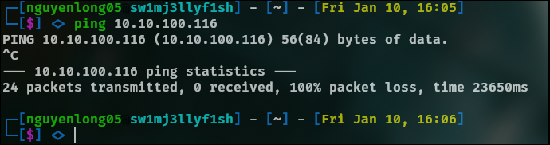

Next I performed a Xmas csan on the first 999 ports of the target

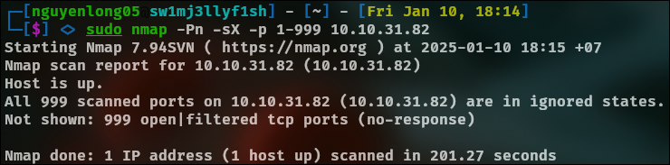

Perform a TCP SYN scan on the first 5000 ports of the target

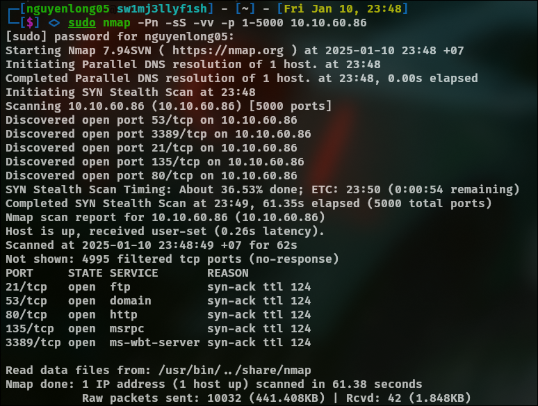

Open Wireshark (see Cryillic's Wireshark Room for instructions) and perform a TCP Connect scan against port 80 on the target, monitoring the results. Make sure you understand what's going on. Deploy the `ftp-anon` script against the box.

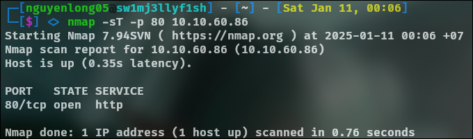

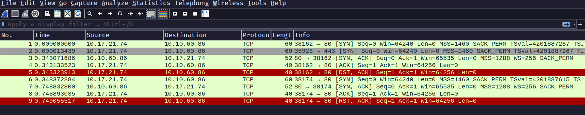

| Packet | Source         | Destination    | Protocol | Info                                                                                              |
|--------|----------------|----------------|----------|---------------------------------------------------------------------------------------------------|
| 1      | 10.17.21.74    | 10.10.60.86    | TCP      | [SYN] - The first step of the TCP handshake, where the client initiates a connection to port 80. |
| 2      | 10.17.21.74    | 10.10.60.86    | TCP      | [SYN] - Another connection attempt to port 443 (likely HTTPS).                                   |
| 3      | 10.10.60.86    | 10.17.21.74    | TCP      | [SYN, ACK] - Server responds to the client's SYN, acknowledging the request to port 80.          |
| 4      | 10.17.21.74    | 10.10.60.86    | TCP      | [ACK] - Client sends an acknowledgment, completing the three-way handshake for port 80.          |
| 5      | 10.17.21.74    | 10.10.60.86    | TCP      | [RST, ACK] - Client resets the connection after the handshake.                                   |
| 6 - 9  | 10.17.21.74    | 10.10.60.86    | TCP      | Similar sequence for another connection attempt (port 38174 to 80), ending with [RST, ACK].      |

Deploy the ftp-anon script against the box

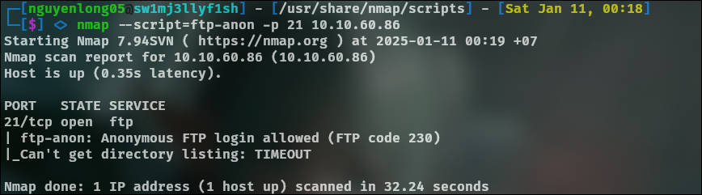

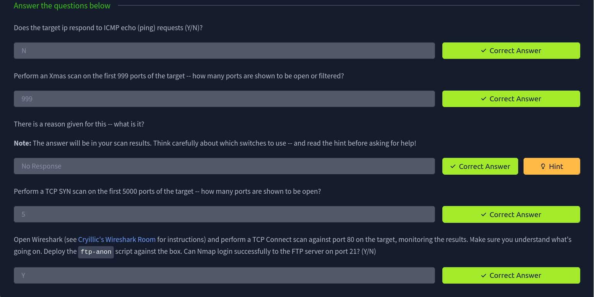