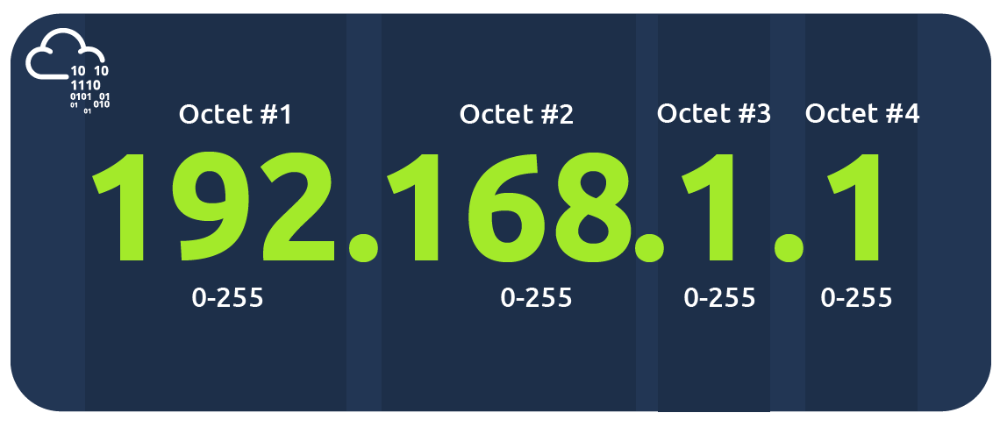
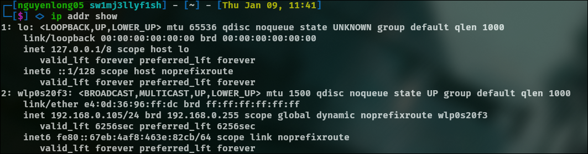
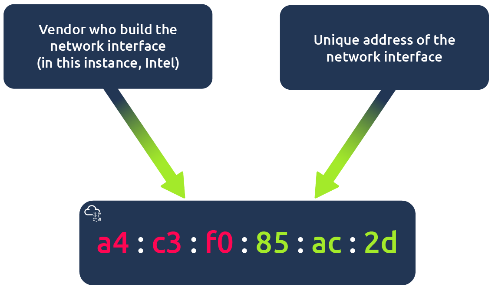
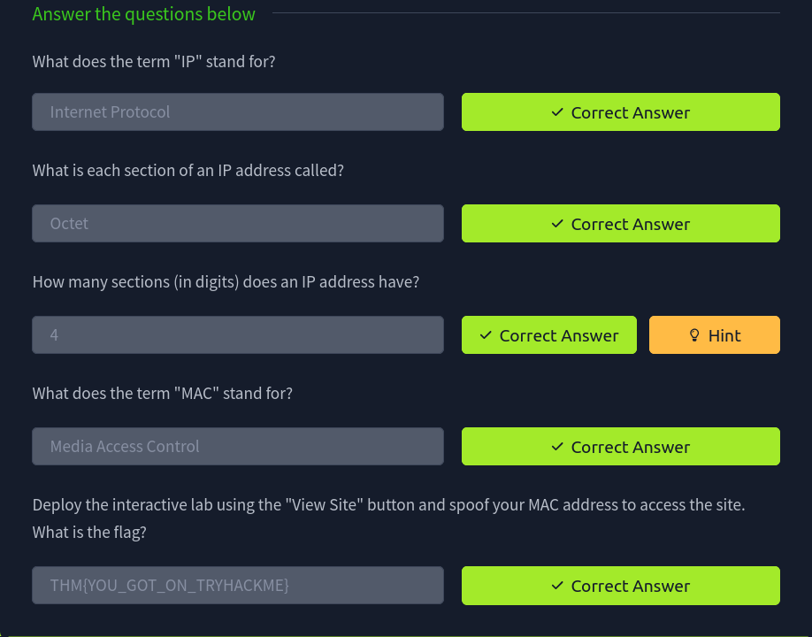
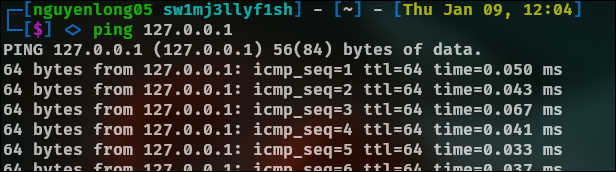
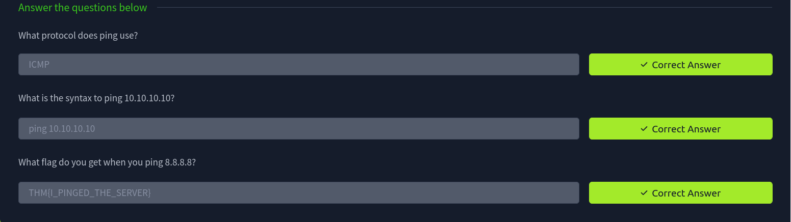

## Identifying Devices on a Network
### IP Addresses
IP address (or Internet Protocol) address can be used as a way of identifying a host on a network for a period of time, where that IP address can then be associated with another device without the IP address changing. First, let's split up precisely what an IP address is in the diagram below:

An IP address is a set of numbers that are divided into four octets. The value of each octet will summarise to be the IP address of the device on the network. This number is calculated through a technique known as IP addressing & subnetting, but that is for another day. What's important to understand here is that IP addresses can change from device to device but cannot be active simultaneously more than once within the same network.

IP Addresses follow a set of standards known as protocols. These protocols are the backbone of networking and force many devices to communicate in the same language. However, we should recall that devices can be on both a private and public network. Depending on where they are will determine what type of IP address they have: a public or private IP address.

A public address is used to identify the device on the Internet, whereas a private address is used to identify a device amongst other devices. Take the table below as an example. Here we have two devices on a private network:

Device Name|IP Address|IP Address Type
-|-|-
DESKTOP-KJE57FD|192.168.1.77|Private
DESKTOP-KJE57FD|86.157.52.21|Public
CMNatic-PC|192.168.1.74|Private
CMNatic-PC|86.157.52.21|Public

These two devices will be able to use their private IP addresses to communicate with each other. However, any data sent to the Internet from either of these devices will be identified by the same public IP address. Public IP addresses are given by your Internet Service Provider (or ISP) at a monthly fee.

IPv4 uses a numbering system of 2^32 IP addresses (4.29 billion)

IPv6 is a new iteration of the Internet Protocol supports up to 2^128 of IP addresses (340 trillion-plus)

The screenshot below compares both an IPv6 and IPv4 address.

IPv4 Addresses:

    127.0.0.1 (Loopback)
    192.168.0.105 (Assigned to the wlp0s20f3 interface)

IPv6 Addresses:

    ::1 (Loopback)
    fe80::67eb:4af8:463e:82cb (Link-local address for wlp0s20f3)

### MAC Addresses

Devices on a network will all have a physical network interface, which is a microchip board found on the device's motherboard. This network interface is assigned a unique address at the factory it was built at, called a MAC (Media Access Control ) address. The MAC address is a twelve-character hexadecimal number (a base sixteen numbering system used in computing to represent numbers) split into two's and separated by a colon. These colons are considered separators. For example, `a4:c3:f0:85:ac:2d`. The first six characters represent the company that made the network interface, and the last six is a unique number.

However, an interesting thing with MAC addresses is that they can be faked or "spoofed" in a process known as spoofing. This spoofing occurs when a networked device pretends to identify as another using its MAC address. When this occurs, it can often break poorly implemented security designs that assume that devices talking on a network are trustworthy. Take the following scenario: A firewall is configured to allow any communication going to and from the MAC address of the administrator. If a device were to pretend or "spoof" this MAC address, the firewall would now think that it is receiving communication from the administrator when it isn't.

## Ping(ICMP)
Ping uses ICMP (Internet Control Message Protocol) packets to determine the performance of a connection between devices, for example, if the connection exists or is reliable.

The time taken for ICMP packets travelling between devices is measured by ping, such as in the screenshot below. This measuring is done using ICMP's echo packet and then ICMP's echo reply from the target device.

Pings can be performed against devices on a network, such as your home network or resources like websites. This tool can be easily used and comes installed on Operating Systems (OSs) such as Linux and Windows. The syntax to do a simple ping is `ping`.

