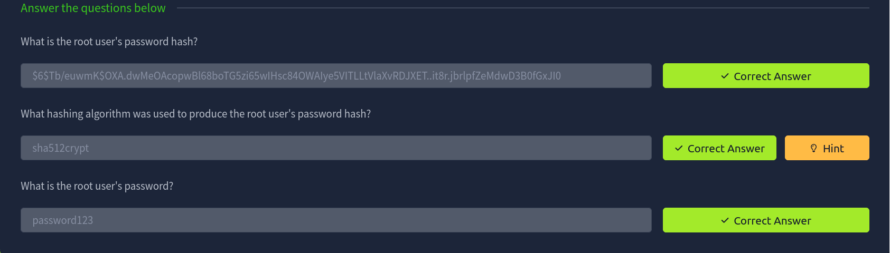
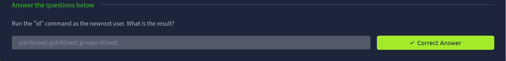

## Task 3
```
[$] <> john --wordlist=rockyou.txt hashes.txt
Loaded 1 password hash (crypt, generic crypt(3) [?/64])
Will run 16 OpenMP threads
Press 'q' or Ctrl-C to abort, almost any other key for status
password123      (root)
1g 0:00:00:00 100% 2.083g/s 3000p/s 3000c/s 3000C/s teacher..michel
Use the "--show" option to display all of the cracked passwords reliably
Session completed
```

## Task 4
create a new password for root (a)

`echo "root:$(mkpasswd -m sha-512 a):17298:0:99999:7:::"`
## Task 5
`openssl passwd a`

