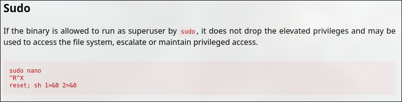
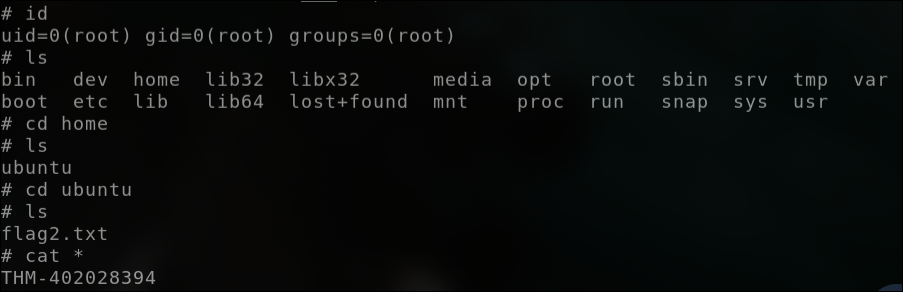

## Privilege Escalation: Sudo

- Username: karen
- Password: Password1

First, access to the machine over SSH

`sudo openvpn nguyenlong05.ovpn`

`ssh karen@10.10.108.33`

Now, we can check the sudo command that **karen** can use by the command:

```
$ sudo -l
Matching Defaults entries for karen on ip-10-10-108-33:
    env_reset, mail_badpass,
    secure_path=/usr/local/sbin\:/usr/local/bin\:/usr/sbin\:/usr/bin\:/sbin\:/bin\:/snap/bin

User karen may run the following commands on ip-10-10-108-33:
    (ALL) NOPASSWD: /usr/bin/find
    (ALL) NOPASSWD: /usr/bin/less
    (ALL) NOPASSWD: /usr/bin/nano
```
https://gtfobins.github.io/ is a valuable source that provides information on how any program, on which you may have sudo rights, can be used. 






