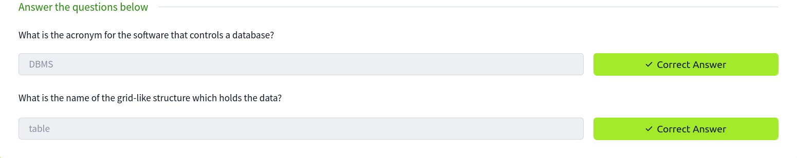
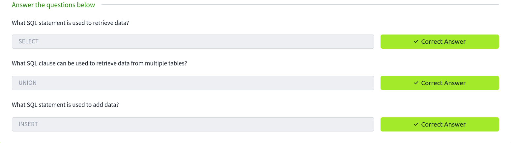

## What is a database?

A database is a way of electronically storing collections of data in an organised manner. A database is controlled by a DBMS, which is an acronym for  Database Management System. DBMSs fall into two camps: Relational and Non-Relational; some common ones you'll come across are MySQL, Microsoft SQL Server, Access, PostgreSQL and SQLite.

Within a DBMS, you can have multiple databases, each containing its own set of related data. For example, you may have a database called "shop". Within this database, you want to store information about products available to purchase, users who have signed up to your online shop, and information about the orders you've received. You'd store this information separately in the database using something called tables. The tables are identified with a unique name for each one. You can see this structure in the diagram below, but you can also see how a business might have other separate databases to store staff information or the accounts team.

## Relational Vs Non-Relational Databases:
A relational database stores information in tables, and often, the tables share information between them; they use columns to specify and define the data being stored and rows actually to store the data. The tables will often contain a column that has a unique ID (primary key), which will then be used in other tables to reference it and cause a relationship between the tables, hence the name relational database.

Non-relational databases, sometimes called NoSQL, on the other hand, are any sort of database that doesn't use tables, columns and rows to store the data. A specific database layout doesn't need to be constructed so each row of data can contain different information, giving more flexibility over a relational database.  Some popular databases of this type are MongoDB, Cassandra and ElasticSearch.

## What is SQL?

SQL (Structured Query Language) is a feature-rich language used for querying databases. These SQL queries are better referred to as statements.

## What is SQL Injection?
The point wherein a web application using SQL can turn into SQL Injection is when user-provided data gets included in the SQL query.

Take the following scenario where you've come across an online blog, and each blog entry has a unique ID number. The blog entries may be either set to public or private, depending on whether they're ready for public release. The URL for each blog entry may look something like this:

`https://website.thm/blog?id=1`

From the URL above, you can see that the blog entry selected comes from the id parameter in the query string. The web application needs to retrieve the article from the database and may use an SQL statement that looks something like the following:

`SELECT * from blog where id=1 and private=0 LIMIT 1;`

From what you've learned in the previous task, you should be able to work out that the SQL statement above is looking in the blog table for an article with the id number of 1 and the private column set to 0, which means it's able to be viewed by the public and limits the results to only one match.

As was mentioned at the start of this task, SQL Injection is introduced when user input is introduced into the database query. In this instance, the id parameter from the query string is used directly in the SQL query.

Let's pretend article ID 2 is still locked as private, so it cannot be viewed on the website. We could now instead call the URL:
 
`https://website.thm/blog?id=2;--`

Which would then, in turn, produce the SQL statement:

`SELECT * from blog where id=2;-- and private=0 LIMIT 1;`

The semicolon in the URL signifies the end of the SQL statement, and the two dashes cause everything afterwards to be treated as a comment. By doing this, you're just, in fact, running the query:

`SELECT * from blog where id=2;--`

Which will return the article with an ID of 2 whether it is set to public or not.
