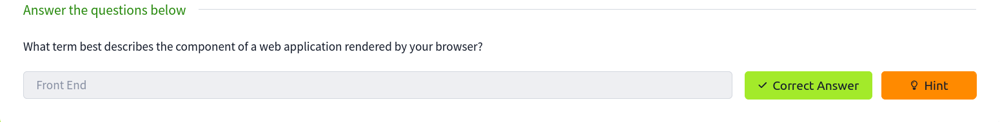
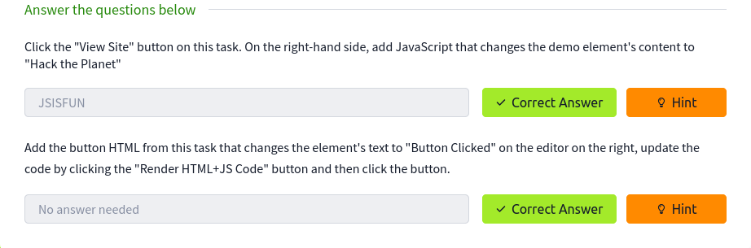
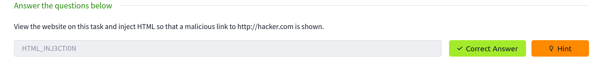

## How websites work
When you visit a website, your browser (like Safari or Google Chrome) makes a request to a web server asking for information about the page you're visiting. It will respond with data that your browser uses to show you the page; a web server is just a dedicated computer somewhere else in the world that handles your requests.

There are two major components that make up a website:

  -  Front End (Client-Side) - the way your browser renders a website.
  
  -  Back End (Server-Side) - a server that processes your request and returns a response.



## HTML
Websites are primarily created using:
- HTML, to build websites and define their structure
 -   CSS, to make websites look pretty by adding styling options
  -  JavaScript, implement complex features on pages using interactivity

HyperText Markup Language (HTML) is the language websites are written in. Elements (also known as tags) are the building blocks of HTML pages and tells the browser how to display content. 

## JavaScript

JavaScript (JS) is one of the most popular coding languages in the world and allows pages to become interactive. HTML is used to create the website structure and content, while JavaScript is used to control the functionality of web pages - without JavaScript, a page would not have interactive elements and would always be static. JS can dynamically update the page in real-time, giving functionality to change the style of a button when a particular event on the page occurs (such as when a user clicks a button) or to display moving animations.

JavaScript is added within the page source code and can be either loaded within `<script>` tags or can be included remotely with the src attribute: `<script src="/location/of/javascript_file.js"></script>`

The following JavaScript code finds a HTML element on the page with the id of "demo" and changes the element's contents to "Hack the Planet" : `document.getElementById("demo").innerHTML = "Hack the Planet";`

HTML elements can also have events, such as "onclick" or "onhover" that execute JavaScript when the event occurs. The following code changes the text of the element with the demo ID to Button Clicked: `<button onclick='document.getElementById("demo").innerHTML = "Button Clicked";'>Click Me!</button>` - onclick events can also be defined inside the JavaScript script tags, and not on elements directly. 



## HTML injection
 Payload:
 ```
 <body>
    <p>Testing:</p>
    <a href="https://www.google.com" target="_blank">link</a>
</body>
```


