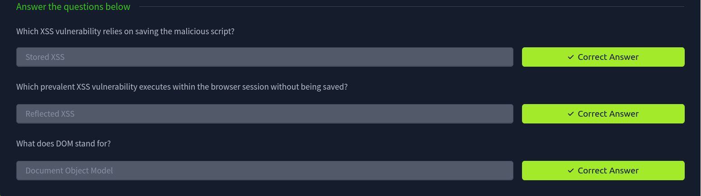

## Terminology and Types
XSS is a vulnerability that allows an attacker to inject malicious scripts into a web page viewed by another user. Consequently, they bypass the Same-Origin Policy (SOP); SOP is a security mechanism implemented in modern web browsers to prevent a malicious script on one web page from obtaining access to sensitive data on another page. SOP defines origin based on the protocol, hostname, and port. Consequently, a malicious ad cannot access data or manipulate the page or its functionality on another origin, such as an online shop or bank page. XSS dodges SOP as it is executing from the same origin.
### JavaScript for XSS

Basic knowledge of JavaScript is pivotal for understanding XSS exploits and adapting them to your needs. Knowing that XSS is a client-side attack that takes place on the target’s web browser, we should try our attacks on a browser similar to that of the target. It is worth noting that different browsers process certain code snippets differently. In other words, one exploit code might work against Google Chrome but not against Mozilla Firefox or Safari.

Suppose you want to experiment with some JavaScript code in your browser. In that case, you need to open the Console found under Web Developer Tools on Firefox, Developer Tools on Google Chrome, and Web Inspector on Safari. Alternatively, use the respective shortcuts:

-    On Firefox, press Ctrl + Shift + K
-    On Google Chrome, press Ctrl + Shift + J
-    On Safari, press Command + Option + J

A web browser with the Console tab ready.

Let’s review and try some essential JavaScript functions:

-    Alert: You can use the alert() function to display a JavaScript alert in a web browser. Try alert(1) or alert('XSS') (or alert("XSS")) to display an alert box with the number 1 or the text XSS.
-    Console log: Similarly, you can display a value in the browser’s JavaScript console using console.log(). Try the following two examples in the console log: console.log(1) and console.log("test text") to display a number or a text string.
-    Encoding: The JavaScript function btoa("string") encodes a string of binary data to create a base64-encoded ASCII string. This is useful to remove white space and special characters or encode other alphabets. The reverse function is atob("base64_string").

Furthermore, you can experiment with displaying values, such as the document.cookie by using alert(document.cookie) for example.
### 
Types of XSS

-    Reflected XSS: This attack relies on the user-controlled input reflected to the user. For instance, if you search for a particular term and the resulting page displays the term you searched for (reflected), the attacker would try to embed a malicious script within the search term.
-    Stored XSS: This attack relies on the user input stored in the website’s database. For example, if users can write product reviews that are saved in a database (stored) and being displayed to other users, the attacker would try to insert a malicious script in their review so that it gets executed in the browsers of other users.
-    DOM-based XSS: This attack exploits vulnerabilities within the Document Object Model (DOM) to manipulate existing page elements without needing to be reflected or stored on the server. This vulnerability is the least common among the three.


## Causes and Implications

Cross-site scripting (XSS) is a web security vulnerability that allows an attacker to inject malicious scripts into a web page viewed by other users. As a result, the unsuspecting users end up running the unauthorized script in their browsers, although the website they are visiting is trusted to be benign. Therefore, XSS can be a severe threat because it exploits users’ trust in a site.
What Makes XSS Possible

There are many reasons why XSS vulnerabilities are still found in web apps. Below, we list a few of them.

**Insufficient input validation and sanitization**

Web applications accept user data, e.g., via forms, and use this data in the dynamic generation of HTML pages. Consequently, malicious scripts can be embedded as part of the legitimate input and will eventually be executed by the browser unless adequately sanitized.

**Lack of output encoding**

The user can use various characters to alter how a web browser processes and displays a web page. For the HTML part, it is critical to properly encode characters such as <, >, ", ', and & into their respective HTML encoding. For JavaScript, special attention should be given to escape ', ", and \\. Failing to encode user-supplied data correctly is a leading cause of XSS vulnerabilities.

**Improper use of security headers**

Various security headers can help mitigate XSS vulnerabilities. For example, Content Security Policy (CSP) mitigates XSS risks by defining which sources are trusted for executable scripts. A misconfigured CSP, such as overly permissive policies or the improper use of unsafe-inline or unsafe-eval directives, can make it easier for the attacker to execute their XSS payloads.

**Framework and language vulnerabilities**

Some older web frameworks did not provide security mechanisms against XSS; others have unpatched XSS vulnerabilities. Modern web frameworks automatically escape XSS by design and promptly patch any discovered vulnerability.

**Third-party libraries**

Integrating third-party libraries in a web application can introduce XSS vulnerabilities; even if the core web application is not vulnerable.

### Implications of XSS

There are many implications of XSS. Below, we list a few of them.

**Session hijacking**

As XSS can be used to steal session cookies, attackers can take over the session and impersonate the victim if successful.

**Phishing and credential theft**

Leveraging XSS, attackers can present a fake login prompt to the user. In one recent case, the browser’s page was partially hidden by a dialogue box requesting users to connect to their cryptocurrency wallet.

**Social engineering**

Using XSS, an attacker can create a legitimate-looking pop-up or alert within a trusted website. This can trick users into clicking malicious links or visiting malicious websites.

**Content manipulation and defacement**

In addition to phishing and social engineering, an attacker might use XSS to change the website for other purposes, such as inflicting damage on the company’s reputation.

**Data exfiltration**

XSS can access and exfiltrate any information displayed on the user’s browser. This includes sensitive information such as personal data and financial information.

**Malware installation**

A sophisticated attacker can use XSS to spread malware. In particular, it can deliver drive-by download attacks on the vulnerable website.


## Reflected XSS

Reflected XSS is a type of XSS vulnerability where a malicious script is reflected to the user’s browser, often via a **crafted URL** or form submission. Consider a search query containing `<script>alert(document.cookie)</script>;` many users wouldn’t be suspicious about such a URL, even if they look at it up close. If processed by a vulnerable web application, it will be executed within the context of the user’s browser.

In this innocuous example, it displays the cookie in an alert box. Obviously, an attacker wants to achieve more than just displaying the cookie as an alert to the user. However, for such an attack to be possible, we need a vulnerable application.

### Vulnerable Web Application

One simple reflected XSS vulnerability is when the user searches for some term, and the search string is included verbatim in the results page. This simple scenario provides an easy target for the attacker to exploit.

Although discovering such vulnerabilities is not always easy, fixing them is straightforward. User input such as `<script>alert('XSS')</script>` should be santized or HTML-encoded to `&lt;script&gt;alert('XSS')&lt;/script&gt;.`

In the following subsections, we provide examples of vulnerable code in the following languages and frameworks:

-    PHP
-    JavaScript (Node.js)
-    Python (Flask)
-    C# (ASP.NET)

**PHP**

Vulnerable code
```php
<?php
$search_query = $_GET['q'];
echo "<p>You searched for: $search_query</p>";
?>
```
`$_GET` is a PHP array containing values from the URL query string. Furthermore, `$_GET['q']` refers to the query string parameter `q`. For example, in `http://shop.thm/search.php?q=table`, `$_GET['q']` has the value table.

As you might have guessed, the vulnerability is caused by the search value displayed on the result page without sanitization. Therefore, an attacker can add a malicious script to the URL, knowing it would be executed. For example, as a proof of concept, the following URL can be tested: `http://shop.thm/search.php?q=<script>alert(document.cookie)</script>` and if the site is vulnerable, an alert box will appear displaying the user’s cookie.

Fixed code
```php
<?php
$search_query = $_GET['q'];
$escaped_search_query = htmlspecialchars($search_query);
echo "<p>You searched for: $escaped_search_query</p>";
?>
```
The PHP function `htmlspecialchars()` converts special characters to HTML entities. The characters `<`, `>`, `&`, `"`, `'` are replaced by default to prevent scripts in the input from executing. You can read its documentation [here](https://www.php.net/htmlspecialchars). 

### JavaScript (Node.js)

Vulnerable code
```js
const express = require('express');
const app = express();

app.get('/search', function(req, res) {
    var searchTerm = req.query.q;
    res.send('You searched for: ' + searchTerm);
});

app.listen(80);
```
If you are unfamiliar with Node.js, the code snippet above uses `Express`, a popular web application framework for Node.js. The `req.query.q` will extract the value of `q`. For example, in `http://shop.thm/search?q=table`, `req.query.q` has the value table. Finally, the response is generated by appending the search term provided by the user to “You searched for:”.

Because the value is taken from the user and inserted in the response HTML without sanitization or escaping, it is easy to append a malicious query. As a proof of concept, we can test the following URL: `http://shop.thm/search?q=<script>alert(document.cookie)</script>`, and if the site is vulnerable, an alert box will appear displaying the user’s cookie.

Fixed code
```js
const express = require('express');
const sanitizeHtml = require('sanitize-html');

const app = express();

app.get('/search', function(req, res) {
    const searchTerm = req.query.q;
    const sanitizedSearchTerm = sanitizeHtml(searchTerm);
    res.send('You searched for: ' + sanitizedSearchTerm);
});

app.listen(80);
```
The solution is achieved by using the sanitizeHtml() from the sanitize-html library. This function removes unsafe elements and attributes. This includes removing script tags, among other elements that could be used for malicious purposes.

Another approach would be by using the `escapeHtml()` function instead of the `sanitizeHtml()` function. As the name indicates, the `escapeHtml()` function aims to escape characters such as `<`, `>`, `&`, `"`, and `'`.
### Python (Flask)

Vulnerable code

```python
from flask import Flask, request

app = Flask(__name__)

@app.route("/search")
def home():
    query = request.args.get("q")
    return f"You searched for: {query}!"

if __name__ == "__main__":
    app.run(debug=True)
```
If you are unfamiliar with Flask, `request.args.get()` is used to access query string parameters from the request URL. In fact, `request.args` contains all the query string parameters in a dictionary-like object. For example, in `http://shop.thm/search?q=table`, `request.args.get("q")` has the value table.

Because the value is taken from the user and inserted in the response HTML without sanitization or escaping, it is easy to append a malicious query. As a proof of concept, we can test the following URL: `http://shop.thm/search?q=<script>alert(document.cookie)</script>`, and if the site is vulnerable, an alert box will appear displaying the user’s cookie.

Fixed code
```python
from flask import Flask, request
from html import escape

app = Flask(__name__)

@app.route("/search")
def home():
    query = request.args.get("q")
    escaped_query = escape(query)
    return f"You searched for: {escaped_query}!"

if __name__ == "__main__":
    app.run(debug=True)
```
The main change is that the user input is now escaped using the `escape()` function from the html module. Note that the `html.escape()` function in Flask is actually an alias for `markupsafe.escape()`. They both come from the `Werkzeug` library and serve the same purpose: escaping unsafe characters in strings. This function converts characters like `<`, `>`, `"`, `'` to HTML escaped entities, disarming any malicious code the user has inserted.
### ASP.NET

Vulnerable code

```C#
public void Page_Load(object sender, EventArgs e)
{
    var userInput = Request.QueryString["q"];
    Response.Write("User Input: " + userInput);
}
```
If you are unfamiliar with ASP.NET and C#, the code above uses `Request.QueryString`, which returns a collection of associated string keys and values. In the example above, we are interested in the value associated with the key q, and we save it in the variable userInput. Finally, the response is created by appending the userInput to another string.

Fixed code
```C#
using System.Web;

public void Page_Load(object sender, EventArgs e)
{
    var userInput = Request.QueryString["q"];
    var encodedInput = HttpUtility.HtmlEncode(userInput);
    Response.Write("User Input: " + encodedInput);
}
```
Again, the solution lies in encoding the user input into HTML-safe strings. ASP.NET C# provides the `HttpUtility.HtmlEncode()` method, which converts various characters, such as `<`, `>`, and `&`, into their respective HTML entity encoding.


## Vulnerable Web Application 1

The attached VM runs a vulnerable version of copyparty. The discovered reflected XSS vulnerability has the ID CVE-2023-38501, and its exploit is published here.

copyparty is file server software. Prior to version 1.8.7, the application contains a reflected cross-site scripting via URL-parameter `?k304=...` and `?setck=...`. The worst-case outcome of this is being able to move or delete existing files on the server, or upload new files, using the account of the person who clicks the malicious link. It is recommended to change the passwords of one's copyparty accounts, unless one have inspected one's logs and found no trace of attacks. Version 1.8.7 contains a patch for the issue. 

**Description**

Copyparty is a portable file server. Versions prior to 1.8.6 are subject to a reflected cross-site scripting (XSS) Attack. 

Vulnerability that exists in the web interface of the application could allow an attacker to execute malicious javascript code by tricking users into accessing a malicious link.

**POC**

https://localhost:3923/?k304=y%0D%0A%0D%0A%3Cimg+src%3Dcopyparty+onerror%3Dalert(1)%3E

`?k304=y `

## Stored XSS

Stored XSS, or Persistent XSS, is a web application security vulnerability that occurs when the application stores user-supplied input and later embeds it in web pages served to other users without proper sanitization or escaping. Examples include web forum posts, product reviews, user comments, and other data stores. In other words, stored XSS takes place when user input is saved in a data store and later included in the web pages served to other users without adequate escaping.

Stored XSS begins with an attacker injecting a malicious script in an input field of a vulnerable web application. The vulnerability might lie in how the web application processes the data in the comment box, forum post, or profile information section. When other users access this stored content, the injected malicious script executes within their browsers. The script can perform a wide range of actions, from stealing session cookies to performing actions on behalf of the user without their consent.

### Vulnerable Web Application

There are many reasons for a web application to be vulnerable to stored XSS. Some of the best practices to prevent stored XSS vulnerabilities are:

-    Validate and sanitize input: Define clear rules and enforce strict validation on all user-supplied data. For instance, only alphanumeric characters can be used in a username, and only integers can be allowed in age fields.
-    Use output escaping: When displaying user-supplied input within an HTML context, encode all HTML-specific characters, such as <, >, and &.
-    Apply context-specific encoding: For instance, within a JavaScript context, we must use JavaScript encoding whenever we insert data within a JavaScript code. On the other hand, data placed in URLs must use relevant URL-encoding techniques, like percent-encoding. The purpose is to ensure that URLs remain valid while preventing script injection.
-     Practice defence in depth: Don’t rely on a single layer of defence; use server-side validation instead of solely relying on client-side validation.

### PHP
Vulnerable Code

The code below has multiple vulnerabilities. It does two things:

-    Read a comment from the user and save it in the $comment variable.
-    Adds the $comment to the column comment in the table comments in a database.
-    Later, it iterates over all the rows in the column comment and displays them on screen.

```php
// Storing user comment
$comment = $_POST['comment'];
mysqli_query($conn, "INSERT INTO comments (comment) VALUES ('$comment')");

// Displaying user comment
$result = mysqli_query($conn, "SELECT comment FROM comments");
while ($row = mysqli_fetch_assoc($result)) {
    echo $row['comment'];
}
```
Fixed Code
```php
// Storing user comment
$comment = mysqli_real_escape_string($conn, $_POST['comment']);
mysqli_query($conn, "INSERT INTO comments (comment) VALUES ('$comment')");

// Displaying user comment
$result = mysqli_query($conn, "SELECT comment FROM comments");
while ($row = mysqli_fetch_assoc($result)) {
    $sanitizedComment = htmlspecialchars($row['comment']);
    echo $sanitizedComment;
}
```
Before displaying every comment on the screen, we pass it through the `htmlspecialchars()` function to ensure all special characters are converted to HTML entities. Consequently, any attempts for stored XSS won’t make it to the end user’s browser.

This is outside the scope of this room; however, if you are curious about the SQL injection vulnerability, this is alleviated using the `mysqli_real_escape_string()`. This function escapes special characters in the input string so it can safely be used in an SQL statement.

### JavaScript (Node.js)
Vulnerable Code

The following JavaScript code reads a comment received from a user that was saved in a database table. We assume the comments array has been populated from the database. Discover what makes it vulnerable to stored XSS and how to solve it.
```js
app.get('/comments', (req, res) => {
  let html = '<ul>';
  for (const comment of comments) {
    html += `<li>${comment}</li>`;
  }
  html += '</ul>';
  res.send(html);
});
```
The main issue in the code above is that it reads the user’s input saved in comment (from the comments array) and is displayed as part of the HTML code. Consequently, when another user views this user’s comment as HTML, the browser will execute any scripts injected into it.

Fixed Code
```js
const sanitizeHtml = require('sanitize-html');

app.get('/comments', (req, res) => {
  let html = '<ul>';
  for (const comment of comments) {
    const sanitizedComment = sanitizeHtml(comment);
    html += `<li>${sanitizedComment}</li>`;
  }
  html += '</ul>';
  res.send(html);
});
```
Part of the solution is sanitizing the HTML before displaying it to the user. We can remove HTML elements outside the allowlist using the `sanitizeHTML()` function. In general, we expect to allow basic text formatting such as bold and italic (`<b>` and `<i>`), but we would remove potentially dangerous or unsafe elements such as `<script>` and `<onload>`. 

### Python (Flask)
Vulnerable Code

```py
from flask import Flask, request, render_template_string
from flask_sqlalchemy import SQLAlchemy

app = Flask(__name__)
app.config['SQLALCHEMY_DATABASE_URI'] = 'sqlite:///site.db'
db = SQLAlchemy(app)

class Comment(db.Model):
    id = db.Column(db.Integer, primary_key=True)
    content = db.Column(db.String, nullable=False)

@app.route('/comment', methods=['POST'])
def add_comment():
    comment_content = request.form['comment']
    comment = Comment(content=comment_content)
    db.session.add(comment)
    db.session.commit()
    return 'Comment added!'

@app.route('/comments')
def show_comments():
    comments = Comment.query.all()
    return render_template_string(''.join(['<div>' + c.content + '</div>' for c in comments]))
```
The first issue is that the `comment_content` is set to the user’s form submission retrieved from `request.form['comment']` without sanitization. This in itself lays the ground for stored XSS and SQL injection. Furthermore, when a user wants to view the comments, they are displayed without escaping, another perfect recipe for stored XSS.

Fixed Code
```py
from flask import Flask, request, render_template_string, escape
from flask_sqlalchemy import SQLAlchemy
from markupsafe import escape

app = Flask(__name__)
app.config['SQLALCHEMY_DATABASE_URI'] = 'sqlite:///site.db'
db = SQLAlchemy(app)

class Comment(db.Model):
    id = db.Column(db.Integer, primary_key=True)
    content = db.Column(db.String, nullable=False)

@app.route('/comment', methods=['POST'])
def add_comment():
    comment_content = request.form['comment']
    comment = Comment(content=comment_content)
    db.session.add(comment)
    db.session.commit()
    return 'Comment added!'

@app.route('/comments')
def show_comments():
    comments = Comment.query.all()
    sanitized_comments = [escape(c.content) for c in comments]
    return render_template_string(''.join(['<div>' + comment + '</div>' for comment in sanitized_comments]))
```
We used the `escape()` function to ensure that any special characters in the user-submitted comment are replaced with HTML entities. As you would expect, the characters `&`, `<`, `>`, `'`, and `"` are converted to HTML entities (`&amp;`, `&lt;`, `&gt;`, `&#39;`, and `&quot;`). We made two changes:

Although the user-submitted input `request.form['comment']` is saved verbatim, the content of each saved comment c goes through the `escape()` function before it is sent to the user’s browser to be displayed as HTML.

### C# (ASP.NET)
Vulnerable Code

The following C# code has multiple vulnerabilities. Take a quick look at the code below and think about what needs to be changed.
```C#
public void SaveComment(string userComment)
{
    var command = new SqlCommand("INSERT INTO Comments (Comment) VALUES ('" + userComment + "')", connection);
    // Execute the command
}

public void DisplayComments()
{
    var reader = new SqlCommand("SELECT Comment FROM Comments", connection).ExecuteReader();
    while (reader.Read())
    {
        Response.Write(reader["Comment"].ToString());
    }
    // Execute the command
}
```
One of the vulnerabilities we observe in the code above is stored XSS. The system stores whatever comment the user inputs without any changes and later displays it to other users. Another vulnerability outside the scope of this room is SQL injection.

Fixed Code
```c#
using System.Web;

public void SaveComment(string userComment)
{
    var command = new SqlCommand("INSERT INTO Comments (Comment) VALUES (@comment)", connection);
    command.Parameters.AddWithValue("@comment", userComment);
}

public void DisplayComments()
{
    var reader = new SqlCommand("SELECT Comment FROM Comments", connection).ExecuteReader();
    while (reader.Read())
    {
        var comment = reader["Comment"].ToString();
        var sanitizedComment = HttpUtility.HtmlEncode(comment);
        Response.Write(sanitizedComment);
    }
    reader.Close();
}
```
With a few changes, the code’s security has improved. Stored-XSS is fixed by using the `HttpUtility.HtmlEncode()` method before displaying the userComment as part of a web page. If you are curious, the SQL injection vulnerability is fixed by using parametrized SQL queries with values passed separately instead of building the SQL query via string concatenation. This can be achieved using the Parameters.`AddWithValue()` method in the `SqlCommand` objects.


### Vulnerable Web Application 2

The attached VM runs the vulnerable project Hospital Management System. The project was uploaded a few years ago and was never updated since then. It is fully functional. Unfortunately, a stored XSS vulnerability was discovered and tagged as `CVE-2021-38757` and an exploit was published, but the application has not been patched till the time of writing.

To exploit the vulnerability, the attacker only needs to click on “Contact”, and fill in the name, email, phone number, and submit the payload in the message field. Something simple such as `<script>alert("Simple XSS")</script>` would still work.

Any message sent via the Contact page appears to the Receptionist when they log in. To log in as the Receptionist via the corresponding tab, use the following credentials:

-    Username: admin
-    Password: admin123

The vulnerability lies in the `contact.php`. Although the code works well, it is not secure. As we can see in the listing below, the user’s submitted message is saved unsanitized in the database table.

```php
<?php 
$con=mysqli_connect("localhost","root","","myhmsdb");
if(isset($_POST['btnSubmit']))
{
	$name = $_POST['txtName'];
	$email = $_POST['txtEmail'];
	$contact = $_POST['txtPhone'];
	$message = $_POST['txtMsg'];

	$query="insert into contact(name,email,contact,message) values('$name','$email','$contact','$message');";
	$result = mysqli_query($con,$query);
	
	if($result)
    {
    	echo '<script type="text/javascript">'; 
		echo 'alert("Message sent successfully!");'; 
		echo 'window.location.href = "contact.html";';
		echo '</script>';
    }
}
```